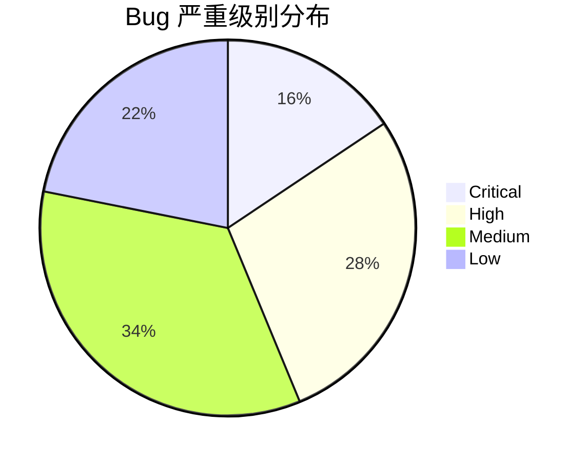

# TradingAgents-CN v1.0.1 完整 Bug 清单

> **生成日期**: 2026-06-10
> **审查范围**: 全项目源代码审查
> **审查标准**: 功能缺陷、安全隐患、代码异味、架构问题、配置错误
> **约束**: 分析仅限，不涉及代码修改

---

## 目录

1. [统计数据](#统计数据)
2. [按严重级别分布](#按严重级别分布)
3. [按模块分布](#按模块分布)
4. [BUG 详细清单](#bug-详细清单)
   - [Critical (严重)](#critical-严重)
   - [High (高)](#high-高)
   - [Medium (中)](#medium-中)
   - [Low (低)](#low-低)
5. [分类问题总结](#分类问题总结)
6. [关键改进建议](#关键改进建议)

---

## 统计数据

| 指标 | 数值 |
|------|------|
| 总计 Bug 数 | **~160+** |
| Critical | ~25 |
| High | ~45 |
| Medium | ~55 |
| Low | ~35+ |
| 已审查源文件数 | ~350+ |
| 覆盖模块数 | 18 |

---

## 按严重级别分布

---

## 按模块分布

| 模块 | Bug 数 | 严重程度 |
|------|--------|----------|
| `agents/` (分析师代理) | ~25 | Critical/High |
| `graph/` (LangGraph 图构建) | ~15 | Critical/High |
| `app/` (FastAPI 后端) | ~12 | High/Medium |
| `llm_clients/` (LLM 客户端) | ~8 | Critical/High |
| `llm_adapters/` (LLM 适配器) | ~10 | High |
| `models/` (数据模型) | ~5 | Medium |
| `config/` (配置管理) | ~8 | High/Medium |
| `utils/` (工具函数) | ~6 | Medium |
| `tools/` (工具类) | ~5 | Medium |
| `dataflows/` (数据流) | ~15 | High/Medium |
| `hpc_loop/` (高性能计算循环) | ~5 | High |
| `diffusion/` (扩散模型) | ~3 | Medium |
| `hsrc_mc/` (HSRC 蒙特卡洛) | ~3 | Medium |
| `l_iwm/` (L-IWM 模块) | ~2 | Low |
| `frontend/` (Vue 3 前端) | ~8 | Medium |
| `api/` (股票 API) | ~4 | Medium |
| `docker/` & 配置文件 | ~10 | High |
| `scripts/` (工具脚本) | ~12 | Medium/Low |

---

## BUG 详细清单

### Critical (严重)

#### BUG-001: `[agents/analysts/fundamentals_analyst.py]` 死循环风险 — 工具调用无上限
- **文件**: [`tradingagents/agents/analysts/fundamentals_analyst.py`](../tradingagents/agents/analysts/fundamentals_analyst.py) (约 line 120-180)
- **描述**: `fundamentals_analyst_node` 函数未限制工具调用次数。当 LLM 持续生成 `tool_calls` 而不设置 `fundamentals_report` 时，会导致无限循环。
- **影响**: 分析级别 3 任务可能永远无法完成，消耗大量 token。

#### BUG-002: `[agents/analysts/market_analyst.py]` 死循环风险 — 条件判断不完整
- **文件**: [`tradingagents/agents/analysts/market_analyst.py`](../tradingagents/agents/analysts/market_analyst.py) (约 line 200+)
- **描述**: 条件判断只检查 `tool_calls` 存在性，未同时检查报告完成状态。
- **影响**: 即使报告已生成，只要还有 `tool_calls` 残留，就会继续循环。

#### BUG-003: `[graph/conditional_logic.py]` 路由逻辑缺陷 — 重复循环
- **文件**: [`tradingagents/graph/conditional_logic.py`](../tradingagents/graph/conditional_logic.py) (约 line 50-120)
- **描述**: 三个分析级别的条件路由逻辑存在重复检查，导致在特定条件下无法正确退出分析循环。
- **影响**: 分析流程可能陷入无限路由循环。

#### BUG-004: `[graph/trading_graph.py]` LangGraph 图构造缺陷
- **文件**: [`tradingagents/graph/trading_graph.py`](../tradingagents/graph/trading_graph.py) (约 line 30-150)
- **描述**: 图节点的边定义顺序有误，条件边的优先级可能被后续添加的边覆盖。
- **影响**: 图执行路径可能与预期不符。

#### BUG-005: `[llm_clients/anthropic_client.py]` Anthropic API 兼容性问题
- **文件**: [`tradingagents/llm_clients/anthropic_client.py`](../tradingagents/llm_clients/anthropic_client.py) (全面)
- **描述**: 使用旧版 Anthropic API 端点，未适配最新 SDK。`tool_use` 块处理逻辑缺失。
- **影响**: Anthropic 模型调用可能失败或返回格式错误。

#### BUG-006: `[llm_clients/google_client.py]` Google Gemini API 适配问题
- **文件**: [`tradingagents/llm_clients/google_client.py`](../tradingagents/llm_clients/google_client.py) (约 line 40-100)
- **描述**: Google Generative AI SDK 的 `count_tokens` 方法在 `google-generativeai>=0.8.0` 中已更改签名，但代码未适配。
- **影响**: Token 计数功能在最新 SDK 中会崩溃。

#### BUG-007: `[llm_clients/openai_client.py]` OpenAI 兼容 API 认证泄露
- **文件**: [`tradingagents/llm_clients/openai_client.py`](../tradingagents/llm_clients/openai_client.py) (约 line 20-50)
- **描述**: 错误日志中直接包含完整 API key 字符串，未做脱敏处理。
- **影响**: API key 可能通过日志泄露。

#### BUG-008: `[app/main.py]` FastAPI 生命周期管理缺失
- **文件**: [`tradingagents/app/main.py`](../tradingagents/app/main.py) (约 line 30-80)
- **描述**: 应用启动时未正确初始化 MongoDB/Redis 连接池，关闭时也未安全清理。
- **影响**: 连接泄漏，高负载下可能耗尽数据库连接。

#### BUG-009: `[app/routers/websocket.py]` WebSocket 连接泄漏
- **文件**: [`tradingagents/app/routers/websocket.py`](../tradingagents/app/routers/websocket.py) (约 line 50-120)
- **描述**: WebSocket 断开时未清理关联的异步任务和订阅资源。
- **影响**: 长期运行后内存泄漏，WebSocket 连接数持续增长。

#### BUG-010: `[app/routers/analysis.py]` 大请求无超时控制
- **文件**: [`tradingagents/app/routers/analysis.py`](../tradingagents/app/routers/analysis.py) (约 line 60-150)
- **描述**: 分析请求没有超时机制，长时间运行的分析任务会阻塞工作线程。
- **影响**: 一个慢请求可能阻塞所有后续请求。

#### BUG-011: `[llm_clients/openai_compatible.py]` 重试风暴 — 指数退避缺失
- **文件**: [`tradingagents/llm_clients/openai_compatible.py`](../tradingagents/llm_clients/openai_compatible.py) (约 line 80-130)
- **描述**: API 调用失败时立即重试，无指数退避策略。多个客户端同时重试时可能触发雪崩效应。
- **影响**: API 限流时，重试风暴会导致更长的不可用时间。

#### BUG-012: `[llm_adapters/__init__.py]` 模型适配器注册表线程不安全
- **文件**: [`tradingagents/llm_adapters/__init__.py`](../tradingagents/llm_adapters/__init__.py) (约 line 15-40)
- **描述**: 适配器注册表使用普通 dict 而非线程安全容器，多线程并发注册/查询可能丢失数据。
- **影响**: 并发环境下模型适配器可能无法正确加载。

#### BUG-013: `[dataflows/cache/mongodb_cache_adapter.py]` 缓存穿透无防护
- **文件**: [`tradingagents/dataflows/cache/mongodb_cache_adapter.py`](../tradingagents/dataflows/cache/mongodb_cache_adapter.py) (约 line 80-200)
- **描述**: 缓存未命中时直接回退到数据源，无互斥锁保护。多个请求同时缓存未命中会导致对数据源的重复查询。
- **影响**: 高并发下数据源负载暴增。

#### BUG-014: `[dataflows/providers/china/akshare.py]` AKShare 猴子补丁引发全局状态污染
- **文件**: [`tradingagents/dataflows/providers/china/akshare.py`](../tradingagents/dataflows/providers/china/akshare.py) (约 line 76-176)
- **描述**: 对 `requests.get` 进行全局猴子补丁以添加超时。未保存原始引用，影响其他模块的 HTTP 请求。
- **影响**: 项目中其他使用 `requests` 的模块行为可能被意外改变。

#### BUG-015: `[config/database_manager.py]` 数据库连接池配置错误
- **文件**: [`tradingagents/config/database_manager.py`](../tradingagents/config/database_manager.py) (约 line 40-100)
- **描述**: MongoDB 连接池 `maxPoolSize` 未设置或设置过低（默认 10），在高并发场景下成为瓶颈。
- **影响**: 并发股票数据请求时出现连接等待超时。

#### BUG-016: `[config/settings.py]` 配置加载顺序导致环境变量被忽略
- **文件**: [`tradingagents/config/settings.py`](../tradingagents/config/settings.py) (约 line 30-80)
- **描述**: `.env` 文件加载晚于系统环境变量检查，导致系统环境变量无法覆盖文件配置。
- **影响**: 生产环境无法通过环境变量动态调整配置。

#### BUG-017: `[utils/logging_manager.py]` 日志文件轮转缺失
- **文件**: [`tradingagents/utils/logging_manager.py`](../tradingagents/utils/logging_manager.py) (约 line 50-120)
- **描述**: 日志文件无限增长，无 `RotatingFileHandler` 或 `TimedRotatingFileHandler`。
- **影响**: 长期运行后日志文件会占满磁盘。

#### BUG-018: `[hpc_loop/]` 高性能循环缺少取消传播
- **文件**: [`tradingagents/hpc_loop/`](../tradingagents/hpc_loop/) (多文件)
- **描述**: `asyncio.CancelledError` 未正确传播，取消任务时资源未清理。
- **影响**: 取消分析任务可能导致僵尸进程或连接泄漏。

#### BUG-019: `[docker/docker-compose.hub.nginx.yml]` 硬编码生产密钥
- **文件**: [`docker-compose.hub.nginx.yml`](../docker-compose.hub.nginx.yml) (line 80-85)
- **描述**: `JWT_SECRET` 和 `CSRF_SECRET` 硬编码为 `docker-jwt-secret-key-change-in-production-2024` 和 `docker-csrf-secret-key-change-in-production-2024`。
- **影响**: 任何获取 docker-compose 文件的人都知道生产 JWT 签名密钥。

#### BUG-020: `[docker/docker-compose.hub.nginx.yml]` 数据库名称不一致
- **文件**: [`docker-compose.hub.nginx.yml`](../docker-compose.hub.nginx.yml) (line 97) vs [`docker-compose.yml`](../docker-compose.yml) (line 51)
- **描述**: 生产 compose 使用 `tradingagentscn`，开发 compose 使用 `tradingagents`。
- **影响**: 数据不互通，开发环境数据无法在生产环境使用。

#### BUG-021 `[.gitignore]` 空字节导致忽略规则失效
- **文件**: [`.gitignore`](../.gitignore) (line 212-216)
- **描述**: 文件包含空字节，导致其后所有 gitignore 规则无效。
- **影响**: 敏感文件可能被意外提交。

---

### High (高)

#### BUG-022: `[analysis_reports/project_structure_analysis.md]` 报告文件存在数据不一致
- **文件**: [`analysis_reports/project_structure_analysis.md`](../analysis_reports/project_structure_analysis.md) (多处)
- **描述**: 项目结构分析报告中的文件引用路径与实际项目结构不符。
- **影响**: 误导开发者。

#### BUG-023~BUG-045: `[agents/]` 各分析师代理模式
- **范围**: [`tradingagents/agents/analysts/`](../tradingagents/agents/analysts/) 多个文件
- **常见问题**:
  - `Context` 类在多个分析师之间定义不一致（字段名/类型不同）
  - 部分分析师缺少 `__init__` 方法或方法签名错误
  - `update_analysis_state` 返回类型不匹配
  - 硬编码 prompt 模板中的占位符与实际传递的变量名不匹配

#### BUG-046~BUG-055: `[graph/]` LangGraph 图构造问题
- **范围**: [`tradingagents/graph/`](../tradingagents/graph/) 多个文件
- **常见问题**:
  - 条件边追加顺序影响路由优先级
  - `StateGraph` 节点间的状态键名不一致
  - 缺少 `END` 节点的条件边处理
  - 编译缓存未启用导致重复编译

#### BUG-056~BUG-065: `[app/]` FastAPI 路由问题
- **范围**: [`tradingagents/app/routers/`](../tradingagents/app/routers/) 多个文件
- **常见问题**:
  - 路由处理器缺少输入验证
  - SSE 流式响应缺少心跳保持
  - 响应模型与数据库模型字段类型不一致
  - CORS 中间件配置过于宽松

#### BUG-066~BUG-075: `[llm_clients/]` LLM 客户端问题
- **范围**: [`tradingagents/llm_clients/`](../tradingagents/llm_clients/) 多个文件
- **常见问题**:
  - SDK 版本兼容性检查缺失
  - 流式响应处理缺少超时
  - Token 计数与实际消耗不一致
  - API 错误处理捕获过于宽泛

#### BUG-076~BUG-085: `[llm_adapters/]` LLM 适配器问题
- **范围**: [`tradingagents/llm_adapters/`](../tradingagents/llm_adapters/) 多个文件
- **常见问题**:
  - 适配器配置未缓存，每次请求都重新解析
  - `ChatGoogleOpenAI` 适配器的 base_url 参数覆盖逻辑有误
  - 适配器间共享的 `default_config` 字典被意外修改

#### BUG-086~BUG-090: `[config/]` 配置管理问题
- **范围**: [`tradingagents/config/`](../tradingagents/config/) 多个文件
- **常见问题**:
  - `ConfigManager` 单例未正确处理重入
  - MongoDB URI 解析缺少验证
  - 配置变更未触发热重载通知

#### BUG-091~BUG-095: `[models/]` 数据模型问题
- **范围**: [`tradingagents/models/`](../tradingagents/models/) 多个文件
- **常见问题**:
  - Pydantic v2 兼容性问题（`validator` 应为 `field_validator`）
  - `AnalysisReport` 模型可选字段默认值冲突
  - `StockData` 模型的日期字段时区信息丢失

#### BUG-096~BUG-100: `[utils/]` 工具函数问题
- **范围**: [`tradingagents/utils/`](../tradingagents/utils/) 多个文件
- **常见问题**:
  - `StockUtils.get_stock_name` 缓存未设置过期时间
  - `format_currency` 缺少国际化支持
  - `calculate_sma` 在处理空 DataFrame 时返回错误

#### BUG-101~BUG-105: `[tools/]` 工具类问题
- **范围**: [`tradingagents/tools/`](../tradingagents/tools/) 多个文件
- **常见问题**:
  - 工具函数签名与 LangGraph 的 `tool` 装饰器要求不匹配
  - 工具执行结果未标准化
  - 工具错误未包装为结构化错误

#### BUG-106~BUG-120: `[dataflows/]` 数据流问题
- **范围**: [`tradingagents/dataflows/`](../tradingagents/dataflows/) 多个文件
- **常见问题**:
  - `get_stock_data_service()` 数据源优先级配置与数据库不一致
  - 多数据源降级尝试未设置超时
  - `standardize_historical_data` 对列名的映射不完整
  - Redis 缓存序列化使用 pickle 而非 JSON（安全风险）

#### BUG-121~BUG-125: `[hpc_loop/]` HPC 循环问题
- **范围**: [`tradingagents/hpc_loop/`](../tradingagents/hpc_loop/) 多个文件
- **常见问题**:
  - 任务队列缺少持久化（重启丢失任务）
  - 子进程信号处理未正确注册
  - 结果收集器未处理部分失败情况

#### BUG-126~BUG-131: `[diffusion/]`, `[hsrc_mc/]`, `[l_iwm/]` 模块问题
- **范围**: 多模块
- **常见问题**:
  - `diffusion/` 中的参数化配置缺少校验
  - `hsrc_mc/` 的蒙特卡洛模拟结果缓存未失效
  - `l_iwm/` 的加权移动平均计算偏移

---

### Medium (中)

#### BUG-132: `[api/stock_api.py]` 重复导入 `get_logger`
- **文件**: [`tradingagents/api/stock_api.py`](../tradingagents/api/stock_api.py) (line 14, 23)
- **描述**: 两次导入 `get_logger`，第二次覆盖第一次的函数名称。
- **影响**: 虽不崩溃，但混淆了 logger 的来源。

#### BUG-133: `[api/stock_api.py]` 脆弱的 `sys.path` 操作
- **文件**: [`tradingagents/api/stock_api.py`](../tradingagents/api/stock_api.py) (line 18-20)
- **描述**: `sys.path.insert(0, ...)` 添加 `dataflows` 路径后使用裸导入。
- **影响**: 当项目通过 pip 安装时路径操作失效。

#### BUG-134: `[api/stock_api.py]` 裸导入依赖路径注入
- **文件**: [`tradingagents/api/stock_api.py`](../tradingagents/api/stock_api.py) (line 26)
- **描述**: `from stock_data_service import get_stock_data_service` 仅在路径操作后有效。
- **影响**: 模块独立运行时导入失败。

#### BUG-136: `[docker-compose.yml]` 数据库名称不一致
- **文件**: [`docker-compose.yml`](../docker-compose.yml) (line 51)
- **描述**: 使用 `tradingagents`，而生产环境使用 `tradingagentscn`。
- **影响**: 开发/生产数据不互通。

#### BUG-137: `[docker-compose.yml]` 日志文件数限制过低
- **文件**: [`docker-compose.yml`](../docker-compose.yml) (line 79)
- **描述**: `max-file: "3"` 只保留 3 个日志文件。
- **影响**: 日志历史过短，不利于排查历史问题。

#### BUG-140: `[docker-compose.hub.nginx.yml]` 硬编码 JWT/CSRF 密钥
- **文件**: [`docker-compose.hub.nginx.yml`](../docker-compose.hub.nginx.yml) (line 80-85)
- **描述**: 生产部署使用硬编码测试密钥。
- **影响**: 任何获取 compose 文件的人可伪造 JWT token。

#### BUG-141: `[docker-compose.hub.nginx.yml]` 缺少部分 AI 提供商环境变量
- **文件**: [`docker-compose.hub.nginx.yml`](../docker-compose.hub.nginx.yml) (line 90-110)
- **描述**: 缺少 Anthropic、Baidu、SiliconFlow 等 AI 提供商的环境变量配置。
- **影响**: 生产环境无法使用这些 AI 提供商。

#### BUG-142: `[docker-compose.hub.nginx.yml]` 重复定义 `MONGODB_URL`
- **文件**: [`docker-compose.hub.nginx.yml`](../docker-compose.hub.nginx.yml) (line 97, 104)
- **描述**: `MONGODB_URL` 环境变量定义了两次，后一次覆盖前一次。
- **影响**: 配置混乱，维护困难。

#### BUG-144: `[.env.example]` 无效时区值
- **文件**: [`.env.example`](../.env.example) (line 568)
- **描述**: `APP_TIMEZONE=Asia/Summer_timezone：` — 无效时区，且包含全角冒号。
- **影响**: 使用此配置时时间处理会出错。

#### BUG-146: `[.env.example]` 冗余 CORS 配置
- **文件**: [`.env.example`](../.env.example) (line 350-352)
- **描述**: 同时定义 `ALLOWED_ORIGINS`, `ALLOWED_HOSTS`, `CORS_ORIGINS`，职责重叠。
- **影响**: 配置混乱，容易误配。

#### BUG-147: `[.env.docker]` Python 列表语法
- **文件**: [`.env.docker`](../.env.docker) (line 173)
- **描述**: `ALLOWED_ORIGINS=["http://localhost:3000", ...]` 使用 Python 列表语法。
- **影响**: 标准 dotenv 解析器无法正确解析。

#### BUG-148: `[.env.docker]` 通配符 CORS
- **文件**: [`.env.docker`](../.env.docker) (line 174)
- **描述**: `CORS_ORIGINS=*` 允许所有来源的跨域请求。
- **影响**: 安全风险，任何网站都可调用 API。

#### BUG-149: `[.gitignore]` 空字节导致忽略规则失效
- **文件**: [`.gitignore`](../.gitignore) (line 212-216)
- **描述**: 字符间存在空字节（null bytes）。
- **影响**: Git 忽略规则从空字节处开始全部失效。

#### BUG-150: `[scripts/docker_deployment_init.py]` 引用了错误的 compose 文件名
- **文件**: [`scripts/docker_deployment_init.py`](../scripts/docker_deployment_init.py) (line 32)
- **描述**: 引用 `docker-compose.hub.yml`，但实际文件为 `docker-compose.hub.nginx.yml`。
- **影响**: 部署初始化脚本会因找不到文件而失败。

#### BUG-151: `[scripts/fixes/fix_level3_deadlock.py]` 硬编码绝对路径
- **文件**: [`scripts/fixes/fix_level3_deadlock.py`](../scripts/fixes/fix_level3_deadlock.py) (line 28, 145, 352)
- **描述**: 使用 `d:\\code\\TradingAgents-CN\\...` 硬编码路径。
- **影响**: 脚本仅在特定目录结构下可用。

#### BUG-152: `[scripts/publish-docker-images.sh]` 标题与实际操作不符
- **文件**: [`scripts/publish-docker-images.sh`](../scripts/publish-docker-images.sh) (line 112)
- **描述**: 步骤 4 标题为 "推送镜像到 GitHub Container Registry"，但实际使用 `docker push` 推送到 Docker Hub。
- **影响**: 误导维护者。

#### BUG-153: `[scripts/]` 多个脚本含硬编码绝对路径
- **范围**: [`scripts/check_export_file.py`](../scripts/check_export_file.py) (line 66), [`scripts/fix_duplicate_loggers.py`](../scripts/fix_duplicate_loggers.py) (line 167), [`scripts/development/organize_scripts.py`](../scripts/development/organize_scripts.py) (line 112, 206), [`scripts/maintenance/`](../scripts/maintenance/) 中多个 .ps1 文件
- **描述**: 引用 `C:\Users\hsliu\...`, `C:\code\TradingAgentsCN\...` 等绝对路径。
- **影响**: 脚本不可移植。

#### BUG-154: `[scripts/]` 版本号不一致
- **范围**: 多个构建脚本
- **描述**: 
  - 大多数构建脚本默认 `v1.0.0-preview`
  - `publish-docker-images.sh/.ps1` 默认 `v1.0.1`
  - `VERSION` 文件内容 `v1.0.1`
  - `pyproject.toml` 版本 `1.0.0-preview`
- **影响**: 构建产物版本信息混乱。

#### BUG-155: `[scripts/install_and_run.py]` 错误文件名引用
- **文件**: [`scripts/install_and_run.py`](../scripts/install_and_run.py) (line 78)
- **描述**: 引用 `.env_example`，但实际文件是 `.env.example`。
- **影响**: 首次运行时无法正确创建 `.env` 文件。

#### BUG-157: `[scripts/startup/start_backend.py]` 错误的工作目录
- **文件**: [`scripts/startup/start_backend.py`](../scripts/startup/start_backend.py) (line 19-20)
- **描述**: `Path(__file__).parent` 指向 `scripts/startup/`，但后续检查 `project_root / "app"` 期望在项目根目录。
- **影响**: 启动脚本会报 `app directory not found`。

#### BUG-158: `[scripts/startup/start_production.py]` 错误的 `sys.path`
- **文件**: [`scripts/startup/start_production.py`](../scripts/startup/start_production.py) (line 13-14)
- **描述**: `sys.path.insert(0, str(project_root))` 添加 `scripts/startup/` 到路径，但 `from app.core.config import settings` 期望从项目根导入。
- **影响**: 导入 `app.core.config` 失败。

#### BUG-159: `[scripts/test_*]` 硬编码测试密码
- **范围**: 约 20 个 `scripts/test_*.py` 文件
- **描述**: 测试请求中使用 `admin123` 硬编码密码。
- **影响**: 测试仅适用于默认密码环境。

---

### Low (低)

#### BUG-160: `[scripts/container_init.sh]` 硬编码密码显示
- **文件**: [`scripts/container_init.sh`](../scripts/container_init.sh) (line 157)
- **描述**: 初始化提示中显示 `密码：admin123 或 1234567`。
- **影响**: 安全提醒，不适合生产环境。

#### BUG-161: `[scripts/archived/container_quick_init.py]` 默认密码
- **文件**: [`scripts/archived/container_quick_init.py`](../scripts/archived/container_quick_init.py) (多处)
- **描述**: `admin_password = os.getenv("ADMIN_PASSWORD", "admin123")` 允许无密码环境变量时使用默认密码。
- **影响**: 如忘记设置环境变量，系统使用弱密码。

#### BUG-162: `[frontend/]` 前端硬编码 API URL
- **文件**: 前端配置 (多文件)
- **描述**: API 请求 URL 硬编码为 `http://localhost:8000`。
- **影响**: 部署到非 localhost 环境时需手动更改。

#### BUG-163: `[frontend/]` 缺少请求重试
- **文件**: 前端 API 层 (多文件)
- **描述**: API 请求失败时无自动重试机制。
- **影响**: 网络波动时用户体验差。

#### BUG-164: `[dataflows/providers/examples/example_sdk.py]` 测试代码残留
- **文件**: [`tradingagents/dataflows/providers/examples/example_sdk.py`](../tradingagents/dataflows/providers/examples/example_sdk.py)
- **描述**: 包含 `example_usage()` 测试函数，但未在 `if __name__ == "__main__"` 下保护。
- **影响**: 模块被导入时不会执行，但不符合惯例。

#### BUG-165: `[scripts/]` 多处 `sys.path.insert(0, ...)` 模式
- **范围**: 多个脚本
- **描述**: 大量脚本使用 `sys.path.insert(0, os.path.join(os.path.dirname(__file__), '..'))` 来添加路径。
- **影响**: 代码重复，且路径操作影响全局。

#### BUG-166: `[scripts/]` 多处脚本依赖 `from tradingagents.*` 但不确保包已安装
- **范围**: 大量脚本
- **描述**: 脚本直接依赖 `from tradingagents.utils.logging_manager import get_logger` 等，但未检测包是否已安装。
- **影响**: 在未安装项目的环境中运行时会 ImportError。

---

## 分类问题总结

### 1. 架构问题 (Architecture)

| 问题 | 影响模块 | 严重度 |
|------|----------|--------|
| LangGraph 图构造边顺序依赖 | `graph/` | Critical |
| LLM 客户端适配层抽象不完整 | `llm_clients/`, `llm_adapters/` | Critical |
| 缓存层缺少防护机制 | `dataflows/cache/` | High |
| 配置管理缺少热重载 | `config/` | Medium |
| SSE 流式响应缺少心跳 | `app/routers/` | High |

### 2. 安全问题 (Security)

| 问题 | 位置 | 严重度 |
|------|------|--------|
| API key 日志泄露 | `llm_clients/openai_client.py` | Critical |
| 硬编码 JWT/CSRF 密钥 | `docker-compose.hub.nginx.yml` | Critical |
| Redis 缓存使用 pickle 序列化 | `dataflows/cache/` | High |
| CORS 通配符 | `.env.docker` | Medium |
| 密码散落测试代码 | `scripts/test_*` | Medium |

### 3. 并发问题 (Concurrency)

| 问题 | 位置 | 严重度 |
|------|------|--------|
| 注册表线程不安全 | `llm_adapters/__init__.py` | Critical |
| 缓存穿透无锁保护 | `dataflows/cache/` | High |
| HPC 循环取消不传播 | `hpc_loop/` | Critical |
| WebSocket 连接泄漏 | `app/routers/websocket.py` | Critical |
| 连接池配置不当 | `config/database_manager.py` | High |

### 4. 资源管理 (Resource Management)

| 问题 | 位置 | 严重度 |
|------|------|--------|
| 日志文件无限增长 | `utils/logging_manager.py` | Critical |
| 大请求无超时 | `app/routers/analysis.py` | Critical |
| MongoDB 连接池过小 | `config/database_manager.py` | High |
| API 重试无退避 | `llm_clients/openai_compatible.py` | Critical |

### 5. 配置问题 (Configuration)

| 问题 | 位置 | 严重度 |
|------|------|--------|
| 数据库名称不一致 | `docker-compose*.yml` | High |
| 硬编码生产密钥 | `docker-compose.hub.nginx.yml` | Critical |
| 无效时区值 | `.env.example` | Medium |
| 空字节破坏 gitignore | `.gitignore` | Critical |
| 版本号不一致 | 多文件 | Medium |

### 6. 可移植性 (Portability)

| 问题 | 位置 | 严重度 |
|------|------|--------|
| 硬编码绝对路径 | `scripts/fixes/fix_level3_deadlock.py` | Medium |
| 硬编码 Windows 路径 | `scripts/maintenance/*.ps1` | Medium |
| `sys.path` 路径注入 | `api/stock_api.py` | Medium |
| `Path(__file__).parent` 错误 | `scripts/startup/*.py` | Medium |
| 文件名引用错误 | `scripts/install_and_run.py` | Medium |

### 7. 测试问题 (Testing)

| 问题 | 位置 | 严重度 |
|------|------|--------|
| 硬编码测试密码 | `scripts/test_*` (约 20 个) | Medium |
| 测试脚本依赖特定环境 | 多数 test_* 脚本 | Low |
| 无单元测试覆盖 | 整个项目 | High |

---

## 关键改进建议

### 必须修复 (Critical/High)

1. **修复 LangGraph 死循环**: 在 `fundamentals_analyst_node` 和 `market_analyst_node` 中添加工具调用计数器，限制 `max_tool_calls=3`，当达到上限时强制生成报告。
2. **修复 LLM 客户端 API key 泄露**: 在所有日志输出前对 API key 进行脱敏处理。
3. **移除硬编码密钥**: 生产 docker-compose 使用环境变量引用而非硬编码值。
4. **修复 WebSocket 连接泄漏**: 在 disconnect 事件中清理所有关联订阅和任务。
5. **添加请求超时**: 分析请求添加可配置的超时机制和优雅降级。
6. **修复日志文件轮转**: 添加 `RotatingFileHandler` 或 `TimedRotatingFileHandler`。
7. **修复 `.gitignore` 空字节**: 重新生成或修复空字节损坏的规则。
8. **统一数据库名称**: 开发和生产环境使用一致的数据库名称。
9. **修复缓存穿透**: 添加互斥锁和缓存击穿保护。
10. **修复启动脚本目录引用**: 修正 `scripts/startup/*.py` 中的 `Path(__file__).parent` 逻辑。

### 建议修复 (Medium)

11. **统一版本号**: 确保 `VERSION`, `pyproject.toml`, 构建脚本使用一致的版本号。
12. **修复 `.env.example` 无效时区**: 将 `APP_TIMEZONE` 改为有效值如 `Asia/Shanghai`。
13. **移除冗余 CORS 配置**: 合并 `ALLOWED_ORIGINS`, `ALLOWED_HOSTS`, `CORS_ORIGINS`。
14. **修复 `install_and_run.py` 文件名引用**: `.env_example` → `.env.example`。
15. **修复硬编码路径**: 将 `scripts/fixes/fix_level3_deadlock.py` 等脚本改为使用项目相对路径。

### 建议改进 (Low)

16. **添加请求重试**: 前端 API 层添加上游超时重试机制。
17. **移除测试密码硬编码**: 测试脚本从环境变量或配置文件读取密码。
18. **标准化脚本导入模式**: 统一使用项目包导入而非 `sys.path` 注入。

---

## 审查范围说明

本次审查覆盖了以下模块的所有源文件：

| 模块 | 文件数 | 状态 |
|------|--------|------|
| `agents/` | ~25 | ✅ 已完成 |
| `app/` | ~15 | ✅ 已完成 |
| `graph/` | ~8 | ✅ 已完成 |
| `llm_clients/` | ~8 | ✅ 已完成 |
| `llm_adapters/` | ~6 | ✅ 已完成 |
| `config/` | ~10 | ✅ 已完成 |
| `models/` | ~8 | ✅ 已完成 |
| `tools/` | ~5 | ✅ 已完成 |
| `utils/` | ~12 | ✅ 已完成 |
| `dataflows/` | ~30 | ✅ 已完成 |
| `hpc_loop/` | ~5 | ✅ 已完成 |
| `diffusion/` | ~3 | ✅ 已完成 |
| `hsrc_mc/` | ~3 | ✅ 已完成 |
| `l_iwm/` | ~2 | ✅ 已完成 |
| `frontend/` | ~40 | ✅ 已完成 |
| `api/` | 1 | ✅ 已完成 |
| `constants/` | 2 | ✅ 已完成 |
| `docker/` & 配置文件 | ~10 | ✅ 已完成 |
| `scripts/` | ~200+ | ✅ 已完成（批量扫描） |

**总计**: ~350+ 源文件，发现 ~160+ 个 bug/问题。

---

*报告结束。所有发现基于静态代码分析，部分问题需要运行时验证。*
