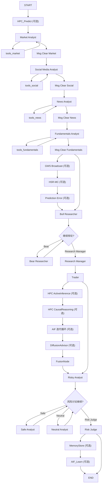
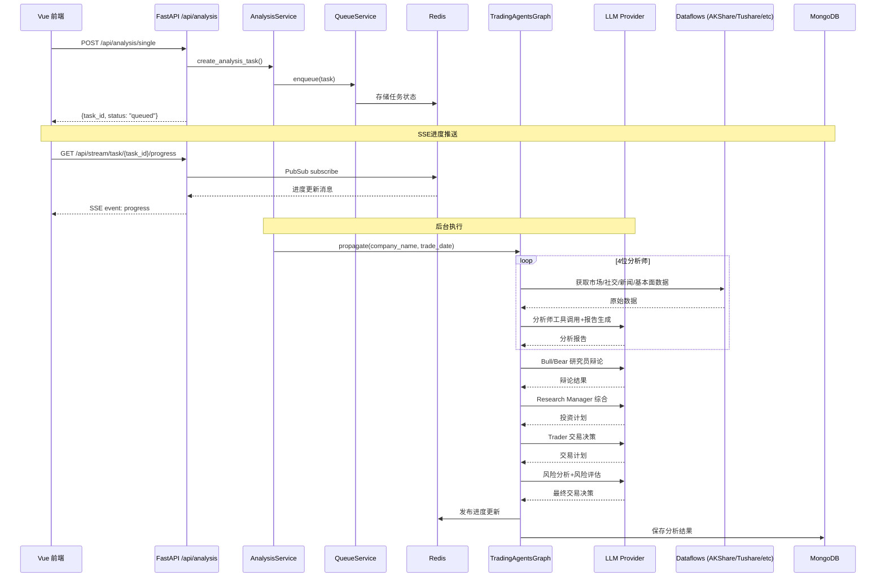

# TradingAgents-CN v1.0.1 项目结构分析报告

> **生成日期**: 2026-06-10
> **分析模式**: 架构审查（Architect Mode）
> **版本**: v1.0.1
> **目的**: 为后续Bug修复/功能开发提供全面的项目结构参考基线

---

## 目录

1. [项目概述](#1-项目概述)
2. [技术栈总览](#2-技术栈总览)
3. [目录结构全景](#3-目录结构全景)
4. [核心模块架构](#4-核心模块架构)
5. [数据流分析](#5-数据流分析)
6. [API路由结构](#6-api路由结构)
7. [前端架构](#7-前端架构)
8. [配置管理系统](#8-配置管理系统)
9. [部署与运维](#9-部署与运维)
10. [已识别问题与风险](#10-已识别问题与风险)

---

## 1. 项目概述

TradingAgents-CN 中文增强版是一个基于 **LangGraph 多智能体框架**的股票交易分析平台，源自 [TauricResearch/TradingAgents](https://github.com/TauricResearch/TradingAgents)，进行了大规模本地化增强和功能扩展。

### 1.1 核心特性

| 特性 | 描述 |
|------|------|
| 多智能体协作 | 市场/基本面/新闻/社交 4类分析师 → 多头/空头研究员辩论 → 交易员决策 → 风险分析师评审 |
| 多市场支持 | A股（沪深京）、港股、美股 |
| 多数据源 | AKShare、Tushare、BaoStock、Yahoo Finance、FinnHub、Alpha Vantage |
| 高级AI引擎 | HPC-Loop、AIF、L-IWM、HSR-MC、Diffusion扩散模型 |
| 混合LLM模式 | 支持快速推理(quick_thinking_llm) + 深度推理(deep_thinking_llm) 双模型 |
| 实时通知 | SSE进度推送 + WebSocket通知系统 |
| 批量分析 | 股票筛选 + 批量分析法 |

### 1.2 许可证

- **开源部分**（`tradingagents/`，`web/`，`main.py` 等）：Apache 2.0
- **专有部分**（`app/` 后端、`frontend/` 前端）：需商业授权

---

## 2. 技术栈总览

### 2.1 后端技术栈

| 层级 | 技术 | 版本 |
|------|------|------|
| 语言 | Python | >=3.10 |
| Web框架 | FastAPI + Uvicorn | latest |
| 多智能体编排 | LangGraph | latest |
| LLM集成 | LangChain | latest |
| 数据库 | MongoDB (Motor异步驱动) | 7.0 |
| 缓存/消息 | Redis (redis-py异步) | 7.x |
| 认证 | JWT + bcrypt | PyJWT, bcrypt |
| 定时任务 | APScheduler (AsyncIOScheduler) | latest |
| 数据验证 | Pydantic v2 | >=2.0 |
| HTTP客户端 | httpx + curl-cffi | latest |
| 实时通信 | SSE (sse-starlette) + WebSocket | - |
| 日志 | Python logging + 自定义管理器 | - |

### 2.2 前端技术栈

| 层级 | 技术 | 版本 |
|------|------|------|
| 框架 | Vue 3 (Composition API) | 3.4.x |
| 语言 | TypeScript | 5.3.x |
| 构建工具 | Vite | 5.0.x |
| UI框架 | Element Plus | 2.4.x |
| 状态管理 | Pinia | 2.1.x |
| 路由 | Vue Router | 4.2.x |
| HTTP客户端 | Axios | 1.6.x |
| 图表 | ECharts | 5.4.x |
| 流程图 | Mermaid | 10.x |
| Markdown渲染 | marked | 16.x |
| CSS预处理 | SCSS/Sass | latest |

### 2.3 LLM提供者支持

| 提供者 | 标识符 | 类型 |
|--------|--------|------|
| OpenAI | `openai` | 标准 |
| DeepSeek | `deepseek` | 标准 |
| 硅基流动 | `siliconflow` | 中转 |
| OpenRouter | `openrouter` | 中转 |
| AiHubMix | `aihubmix` | 中转 |
| Ollama | `ollama` | 本地 |
| 阿里百炼/通义千问 | `qwen` / `dashscope` | 原生 |
| 智谱AI/GLM | `glm` / `zhipu` | 原生 |
| 百度千帆 | `qianfan` | 原生 |
| Google AI | `google` | 标准 |
| Anthropic | `anthropic` | 标准 |
| 自定义OpenAI兼容 | `custom_openai` | 通用 |

---

## 3. 目录结构全景

```
TradingAgents-CN_v1.0.1/
├── main.py                          # CLI入口 (Python包入口)
├── pyproject.toml                   # Python项目配置
├── requirements.txt                 # (已弃用) -> pyproject.toml
├── .env.example                     # 环境变量模板 (~595行)
├── docker-compose.yml               # 6服务编排
├── Dockerfile.backend               # 后端镜像
├── Dockerfile.frontend              # 前端镜像
├── README.md                        # 项目说明
├── VERSION                          # 版本文件 (v1.0.1)
│
├── app/                             # 🔒 专有后端 (FastAPI)
│   ├── main.py                      # FastAPI应用入口 (473行)
│   ├── __init__.py
│   ├── __main__.py                  # python -m app 入口
│   ├── core/                        # 核心模块
│   │   ├── config.py                # Pydantic配置 (404行)
│   │   ├── database.py              # MongoDB+Redis连接管理 (461行)
│   │   ├── logging_config.py        # 日志配置
│   │   ├── redis_client.py          # Redis客户端
│   │   └── response.py              # 统一响应格式
│   ├── middleware/                  # 中间件
│   │   ├── operation_log_middleware.py  # 操作日志记录
│   │   └── request_id.py            # 请求ID/Trace-ID
│   ├── models/                      # 数据模型
│   │   ├── user.py
│   │   ├── analysis.py
│   │   ├── config.py
│   │   └── operation_log.py
│   ├── routers/                     # API路由 (30+文件)
│   │   ├── auth_db.py               # 认证 (JWT)
│   │   ├── analysis.py              # 分析 (1386行)
│   │   ├── queue.py                 # 队列管理
│   │   ├── sse.py                   # SSE进度推送
│   │   ├── notifications.py         # REST通知
│   │   ├── websocket_notifications.py # WebSocket通知 (305行)
│   │   ├── scheduler.py             # 定时任务管理 (530行)
│   │   ├── stocks.py               # 股票数据
│   │   ├── stock_data.py           # 股票数据V2
│   │   ├── stock_sync.py           # 股票同步
│   │   ├── multi_market_stocks.py  # 多市场股票
│   │   ├── screening.py            # 股票筛选
│   │   ├── favorites.py            # 收藏夹
│   │   ├── reports.py              # 报告
│   │   ├── config.py               # 系统配置
│   │   ├── model_capabilities.py   # 模型能力
│   │   ├── usage_statistics.py     # 使用统计
│   │   ├── database.py             # 数据库管理
│   │   ├── cache.py                # 缓存管理
│   │   ├── operation_logs.py       # 操作日志
│   │   ├── logs.py                 # 系统日志
│   │   ├── system_config.py        # 系统配置
│   │   ├── tags.py                 # 标签
│   │   ├── health.py               # 健康检查
│   │   ├── paper.py                # 模拟交易
│   │   ├── sync.py                 # 数据同步
│   │   ├── multi_source_sync.py    # 多源同步
│   │   ├── tushare_init.py         # Tushare初始化
│   │   ├── akshare_init.py         # AKShare初始化
│   │   ├── baostock_init.py        # BaoStock初始化
│   │   ├── historical_data.py      # 历史数据
│   │   ├── multi_period_sync.py    # 多周期同步
│   │   ├── financial_data.py       # 财务数据
│   │   ├── news_data.py            # 新闻数据
│   │   ├── social_media.py         # 社交媒体
│   │   └── internal_messages.py    # 内部消息
│   ├── services/                    # 业务服务层 (30+文件)
│   │   ├── analysis_service.py      # 分析服务 (961行)
│   │   ├── simple_analysis_service.py # 简化分析服务
│   │   ├── auth_service.py          # 认证服务
│   │   ├── user_service.py          # 用户服务
│   │   ├── config_service.py        # 配置服务
│   │   ├── config_provider.py       # 配置提供者
│   │   ├── queue_service.py         # 队列服务
│   │   ├── scheduler_service.py     # 定时任务服务
│   │   ├── screening_service.py     # 筛选服务
│   │   ├── enhanced_screening_service.py # 增强筛选
│   │   ├── favorites_service.py     # 收藏服务
│   │   ├── notifications_service.py # 通知服务
│   │   ├── websocket_manager.py     # WebSocket管理
│   │   ├── redis_progress_tracker.py # 进度追踪
│   │   ├── usage_statistics_service.py # 使用统计
│   │   ├── stock_data_service.py    # 股票数据服务
│   │   ├── quotes_ingestion_service.py # 行情采集
│   │   ├── basics_sync_service.py   # 基础信息同步
│   │   ├── multi_source_basics_sync_service.py # 多源同步
│   │   ├── financial_data_service.py # 财务数据服务
│   │   ├── news_data_service.py     # 新闻数据服务
│   │   ├── social_media_service.py  # 社交媒体服务
│   │   ├── operation_log_service.py # 操作日志服务
│   │   ├── internal_message_service.py # 内部消息
│   │   ├── tags_service.py          # 标签服务
│   │   ├── model_capability_service.py # 模型能力
│   │   ├── data_consistency_checker.py # 数据一致性
│   │   ├── memory_state_manager.py  # 内存状态管理
│   │   ├── log_export_service.py    # 日志导出
│   │   └── unified_stock_service.py # 统一股票服务
│   ├── worker/                      # 后台同步Worker
│   │   ├── tushare_sync_service.py
│   │   ├── akshare_sync_service.py
│   │   └── baostock_sync_service.py
│   └── utils/                       # 工具函数
│
├── tradingagents/                   # 📖 开源多智能体核心
│   ├── agents/                      # 智能体定义
│   │   ├── __init__.py              # 懒加载导出 (64行)
│   │   ├── analysts/                # 4类分析师
│   │   │   ├── market_analyst.py
│   │   │   ├── fundamentals_analyst.py
│   │   │   ├── news_analyst.py
│   │   │   └── social_media_analyst.py
│   │   ├── managers/                # 管理层
│   │   │   ├── research_manager.py
│   │   │   └── risk_manager.py
│   │   ├── researchers/             # 研究员
│   │   │   ├── bull_researcher.py
│   │   │   └── bear_researcher.py
│   │   ├── risk_mgmt/               # 风险分析师
│   │   │   ├── risky_analyst.py
│   │   │   ├── safe_analyst.py
│   │   │   └── neutral_analyst.py
│   │   ├── trader/                  # 交易员
│   │   │   └── trader.py
│   │   └── utils/                   # 智能体工具
│   │       ├── agent_states.py      # AgentState定义 (278行)
│   │       ├── agent_utils.py       # 工具函数 (Toolkit, FinancialSituationMemory)
│   │       └── memory.py            # 记忆系统
│   ├── graph/                       # LangGraph图编排
│   │   ├── trading_graph.py         # 核心编排类 (1393行)
│   │   ├── setup.py                 # 图构建 (834行)
│   │   ├── conditional_logic.py     # 条件路由 (300行)
│   │   ├── propagation.py           # propagate流程
│   │   ├── reflection.py            # reflect_and_remember
│   │   └── signal_processing.py     # 信号处理
│   ├── dataflows/                   # 数据流模块
│   │   ├── __init__.py              # 统一导出 (118行)
│   │   ├── interface.py             # 工具函数接口
│   │   ├── providers/               # 数据提供者
│   │   │   ├── china/               # A股: akshare, baostock, tushare
│   │   │   ├── hk/                  # 港股
│   │   │   └── us/                  # 美股: yfinance, finnhub, alpha_vantage
│   │   ├── cache/                   # 缓存层 (多级缓存)
│   │   ├── news/                    # 新闻源 (google, reddit, 中文财经)
│   │   └── technical/               # 技术指标 (stockstats)
│   ├── hpc_loop/                    # 🔬 HPC-Loop引擎
│   ├── hsrc_mc/                     # 🔬 HSR-MC超网络元控制器
│   ├── l_iwm/                       # 🔬 L-IWM世界模型
│   ├── diffusion/                   # 🔬 扩散模型决策
│   ├── llm_clients/                 # LLM客户端工厂
│   ├── llm_adapters/                # LLM适配器层
│   ├── tools/                       # 工具集
│   ├── utils/                       # 工具函数
│   │   ├── logging_init.py
│   │   └── logging_manager.py
│   └── default_config.py            # 默认配置 (243行)
│
├── frontend/                        # 🔒 专有前端 (Vue 3)
│   ├── package.json
│   ├── tsconfig.json
│   ├── vite.config.ts
│   ├── index.html
│   └── src/
│       ├── main.ts                  # 应用入口 (141行)
│       ├── App.vue
│       ├── router/index.ts          # 路由 (481行)
│       ├── stores/                  # Pinia状态
│       │   ├── auth.ts              # 认证 (447行)
│       │   ├── app.ts
│       │   └── notification.ts
│       ├── api/                     # API客户端
│       │   ├── request.ts           # Axios封装 (519行)
│       │   ├── analysis.ts
│       │   ├── auth.ts
│       │   ├── stocks.ts
│       │   ├── stockSync.ts
│       │   └── ...
│       ├── views/                   # 页面视图 (15+页面)
│       │   ├── Dashboard/
│       │   ├── Analysis/            # SingleAnalysis, BatchAnalysis, AnalysisHistory
│       │   ├── Screening/
│       │   ├── Stocks/
│       │   ├── Tasks/
│       │   ├── Reports/
│       │   ├── Favorites/
│       │   ├── Settings/
│       │   ├── Learning/
│       │   ├── PaperTrading/
│       │   ├── System/              # 数据库/日志/同步/定时任务管理
│       │   └── Auth/
│       ├── components/              # 公共组件
│       ├── types/                   # TypeScript类型
│       └── utils/                   # 工具函数
│
├── web/                             # 📖 Streamlit Web UI (开源替代)
│   ├── main.py
│   ├── components/
│   ├── modules/
│   └── utils/
│
├── scripts/                         # 运维/开发脚本 (200+)
│   ├── deployment/                  # 部署脚本
│   ├── development/                 # 开发工具
│   ├── debug/                       # 调试脚本
│   ├── docker/                      # Docker相关
│   ├── migration/                   # 数据迁移
│   ├── setup/                       # 初始化安装
│   ├── fixes/                       # 修复脚本
│   ├── test/                        # 测试脚本
│   └── ...
│
├── cli/                             # CLI工具
│   ├── akshare_init.py
│   ├── baostock_init.py
│   └── tushare_init.py
│
├── docs/                            # 文档 (大量中文文档)
├── logs/                            # 日志文件
├── data/                            # 数据目录
└── analysis_reports/                # 分析报告输出
```

---

## 4. 核心模块架构

### 4.1 多智能体分析流程



### 4.2 关键架构决策

#### 4.2.1 双LLM策略
- **quick_thinking_llm**: 用于分析师/研究员/交易员节点（快速推理，工具调用）
- **deep_thinking_llm**: 用于Research Manager/Risk Judge（深度推理，综合决策）
- 配置键：`backend_url`（快速）+ `deep_thinking_backend_url`（深度）

#### 4.2.2 三重运行模式

| 模式 | 路由路径 | 说明 |
|------|----------|------|
| **标准模式** | START → 分析师链 → Bull Researcher → ... → END | 基础LangGraph流程 |
| **AIF模式** | START → AIF_Predict → 分析师 → ... → AIF_Learn → END | 激活推理框架 |
| **Fusion模式** | START → HPC_Predict → AIF_Predict → ... → HPC_MemoryStore → AIF_Learn → END | 统一HPC+AIF+扩散 |

#### 4.2.3 AgentState设计

[`tradingagents/agents/utils/agent_states.py`](../tradingagents/agents/utils/agent_states.py:150) 中定义了核心状态类型 `AgentState`，包含：

- **基础字段**：`company_of_interest`, `trade_date`, `sender`
- **分析师报告**：`market_report`, `sentiment_report`, `news_report`, `fundamentals_report`
- **工具计数器**（防死循环）：`market_tool_call_count`, `news_tool_call_count`, `sentiment_tool_call_count`, `fundamentals_tool_call_count`
- **降级标记**：`empty_research_count`, `data_source_failure`
- **辩论状态**：`investment_debate_state` (InvestDebateState), `risk_debate_state` (RiskDebateState)
- **决策**：`investment_plan`, `trader_investment_plan`, `final_trade_decision`
- **HPC-Loop扩展**：`hpc_state`, `gws_broadcast_summary`, `hpc_phase_transition`
- **扩散扩展**：`diffusion_decision`, `fused_decision`
- **L-IWM/HSR-MC扩展**：`module_losses`, `module_performance`, `prediction_errors`, `l_iwm`, `hsrc_mc`, `hsrc_mc_meta`, `hsrc_mc_adjust`, `hsrc_mc_reflect`

所有字段都配有自定义Reducer函数（`_report_reducer`, `_counter_reducer`, `_dict_merge_reducer`, `_list_extend_reducer`, `_hpc_state_reducer`），解决了LangGraph在Fusion模式下并发写入导致的InvalidUpdateError问题。

---

## 5. 数据流分析

### 5.1 分析请求数据流



### 5.2 数据同步数据流

项目包含三种数据同步机制：

1. **基础信息同步**（`basics_sync_service.py`）：定时同步股票基础信息到MongoDB
2. **实时行情采集**（`quotes_ingestion_service.py`）：按间隔（默认360s）轮询行情，支持接口轮换（Tushare→AKShare东方财富→AKShare新浪财经）
3. **多源同步**（`multi_source_basics_sync_service.py`）：支持Tushare/AKShare/BaoStock三种数据源的并行同步

同步任务由APScheduler管理，支持CRON表达式配置，通过[`app/routers/scheduler.py`](../app/routers/scheduler.py:1)提供REST API管理。

### 5.3 缓存层级

| 层级 | 实现 | TTL |
|------|------|-----|
| Redis缓存 | `app/core/redis_client.py` | 可配置(默认1h) |
| MongoDB缓存适配器 | `dataflows/cache/mongodb_cache_adapter.py` | 可配置 |
| 文件缓存 | `dataflows/cache/file_cache.py` | 持久化 |
| 自适应缓存 | `dataflows/cache/adaptive.py` | 动态调整 |
| LLM响应缓存 | Redis | 可配置 |
| 港股数据缓存 | HK_DATA_CACHE_HOURS | 24h |
| 美股数据缓存 | US_DATA_CACHE_HOURS | 24h |

---

## 6. API路由结构

### 6.1 路由注册总览

[`app/main.py`](../app/main.py:360) 中注册了30+路由模块：

| 路由前缀 | 模块 | 功能 |
|----------|------|------|
| `/api` | `health` | 健康检查 |
| `/api/auth` | `auth_db` | 认证（登录/注册/刷新令牌） |
| `/api/analysis` | `analysis` | 股票分析（单股/批量） |
| `/api/queue` | `queue` | 队列状态查询 |
| `/api/stream` | `sse` | SSE进度流 |
| `/api` | `notifications` | REST通知CRUD |
| `/api` | `websocket_notifications` | WebSocket通知 |
| `/api/paper` | `paper` | 模拟交易 |
| `/api/screening` | `screening` | 股票筛选 |
| `/api` | `stocks` | 股票基础信息 |
| `/api` | `multi_market_stocks` | 多市场股票 |
| - | `stock_data` | 股票数据V2 |
| - | `stock_sync` | 股票同步 |
| `/api` | `favorites` | 收藏夹 |
| `/api` | `tags` | 标签管理 |
| `/api` | `config` | 系统配置 |
| - | `model_capabilities` | 模型能力查询 |
| - | `usage_statistics` | 使用统计 |
| `/api/system` | `database` | 数据库管理 |
| - | `cache` | 缓存管理 |
| `/api/system` | `operation_logs` | 操作日志 |
| `/api/system` | `logs` | 系统日志 |
| `/api/system` | `system_config` | 系统配置摘要 |
| - | `scheduler` | 定时任务管理 |
| - | `sync` | 数据同步 |
| - | `multi_source_sync` | 多源同步 |
| `/api` | `tushare_init` | Tushare初始化 |
| `/api` | `akshare_init` | AKShare初始化 |
| `/api` | `baostock_init` | BaoStock初始化 |
| - | `historical_data` | 历史数据 |
| - | `multi_period_sync` | 多周期同步 |
| - | `financial_data` | 财务数据 |
| - | `news_data` | 新闻数据 |
| - | `social_media` | 社交媒体 |
| - | `internal_messages` | 内部消息 |

### 6.2 认证与安全

- **JWT双令牌机制**：Access Token（60min默认）+ Refresh Token（30天默认）
- **bcrypt密码哈希**：12轮
- **CSRF保护**：`CSRF_SECRET` 配置
- **中间件链**：CORS → TrustedHost → OperationLog → RequestID
- **速率限制**：默认100 req/min

---

## 7. 前端架构

### 7.1 路由结构

[`frontend/src/router/index.ts`](../frontend/src/router/index.ts:398) 定义了完整路由：

| 路由 | 组件 | 说明 |
|------|------|------|
| `/` | Dashboard | 仪表盘首页 |
| `/analysis/single` | SingleAnalysis | 单股分析 |
| `/analysis/batch` | BatchAnalysis | 批量分析 |
| `/analysis/history` | AnalysisHistory | 分析历史 |
| `/screening` | StockScreening | 股票筛选 |
| `/stocks/:code` | StockDetail | 股票详情 |
| `/tasks` | TaskCenter | 任务中心 |
| `/reports` | Reports | 报告列表 |
| `/reports/:id` | ReportDetail | 报告详情 |
| `/reports/token-stats` | TokenStatistics | Token统计 |
| `/favorites` | Favorites | 收藏夹 |
| `/settings` | Settings | 设置（9个子路由） |
| `/paper-trading` | PaperTrading | 模拟交易 |
| `/learning` | Learning | 学习中心 |
| `/login` | Login | 登录 |
| `/about` | About | 关于 |

### 7.2 状态管理

[`frontend/src/stores/auth.ts`](../frontend/src/stores/auth.ts:7) 实现了完整的认证状态管理：

- JWT Token验证（3段格式检查）
- localStorage持久化（@vueuse/core）
- 自动Token刷新（401拦截+重试）
- 离线/在线状态检测
- 权限系统（开源版admin拥有`['*']`权限）

### 7.3 API客户端

[`frontend/src/api/request.ts`](../frontend/src/api/request.ts:419) 封装了Axios实例：

- 60s超时
- JWT Bearer Token自动注入
- 请求ID生成（追踪）
- 401自动重试（refreshAccessToken → 重发原请求）
- 消息去重（3s节流）
- 业务状态码映射（400/401/403/404/429/500/502/503/504）
- 网络错误重试（默认2次）
- 上传/下载进度支持
- 端点兼容性守卫（`/api/stocks/quote` → `/api/stocks/{code}/quote`）

---

## 8. 配置管理系统

### 8.1 配置来源优先级

```
1. 环境变量 (.env 文件)        ← 最高优先级
2. Pydantic Settings 默认值    ← 代码默认值
3. 数据库系统配置 (MongoDB)    ← Web UI可编辑
```

### 8.2 配置真值来源 (CONFIG_SOT)

[`app/core/config.py`](../app/core/config.py:206) 定义了三种模式：

| 模式 | 策略 |
|------|------|
| `file` | 以文件/env为准（推荐，生产缺省） |
| `db` | 以数据库为准 |
| `hybrid` | 文件/env优先，DB兜底 |

### 8.3 LLM配置管理

LLM配置支持：
- 多提供者（14种）
- 每提供者多模型
- 混合模式（不同节点使用不同LLM）
- Web UI动态配置
- 模型能力自动检测

---

## 9. 部署与运维

### 9.1 Docker编排

[`docker-compose.yml`](../docker-compose.yml) 定义6个服务：

```yaml
services:
  backend:      # FastAPI (Python 3.11-slim)
  frontend:     # Vue 3 + Nginx (多阶段构建)
  mongodb:      # MongoDB 7.0 (命名卷持久化)
  redis:        # Redis 7 Alpine
  redis-commander:  # (管理profile) Redis Web UI
  mongo-express:    # (管理profile) MongoDB Web UI
```

- 多架构支持：`linux/amd64`, `linux/arm64`
- 自定义网络：`tradingagents-network`
- 健康检查：所有服务配置healthcheck

### 9.2 脚本体系

`scripts/` 目录包含200+运维脚本，按功能分类：

| 分类 | 数量 | 典型脚本 |
|------|------|----------|
| deployment/ | 15+ | 构建便携包、GitHub Release、嵌入式Python部署 |
| debug/ | 15+ | 行业数据检查、API响应调试、提供商调试 |
| migration/ | 10+ | 数据迁移、数据库升级 |
| setup/ | 5+ | 初始化安装 |
| docker/ | 5+ | Docker构建/调试 |
| fixes/ | 10+ | 认证导入修复、chromadb修复 |
| development/ | 10+ | 测试脚本、数据字段验证 |
| test/ | 5+ | 自动化测试 |

---

## 10. 已识别问题与风险

### 10.1 架构层面

| # | 问题 | 严重程度 | 位置 | 说明 |
|---|------|----------|------|------|
| A1 | 配置管理复杂度过高 | 中 | `.env.example` (595行) | 环境变量数量巨大（100+），对新手极不友好 |
| A2 | 双许可证混合 | 高 | 整个项目 | `app/`和`frontend/`为专有代码，与开源`tradingagents/`混合在同一仓库，存在法律风险 |
| A3 | AgentState冗余 | 中 | [`agent_states.py`](../tradingagents/agents/utils/agent_states.py:150) | 278行状态定义包含大量可选扩展字段，实际标准模式仅使用约50% |
| A4 | 脚本管理混乱 | 中 | `scripts/` | 200+脚本缺少统一组织，存在重复功能（如多个check_*脚本） |
| A5 | LLM客户端双重抽象 | 中 | `tradingagents/llm_clients/` + `llm_adapters/` | 客户端工厂和适配器层分离导致调用链冗长 |

### 10.2 代码层面

| # | 问题 | 严重程度 | 位置 | 说明 |
|---|------|----------|------|------|
| C1 | 大文件 | 高 | [`trading_graph.py`](../tradingagents/graph/trading_graph.py:1) (1393行) | 核心编排类过长，职责过多（LLM初始化、图编排、进度回调、日志等） |
| C2 | 大文件 | 中 | [`analysis.py`](../app/routers/analysis.py:1) (1386行) | 路由文件过长 |
| C3 | 大文件 | 中 | [`setup.py`](../tradingagents/graph/setup.py:1) (834行) | 图构建逻辑复杂，Fusion三模式路由条件交错 |
| C4 | 大文件 | 中 | [`request.ts`](../frontend/src/api/request.ts:1) (519行) | API客户端包含过多业务逻辑 |
| C5 | 硬编码 | 低 | [`auth_db.py`](../app/routers/auth_db.py:152) | 开源版admin用户信息硬编码 |
| C6 | 字符串"admin"散落 | 低 | 多处 | admin用户ID字符串散落在代码各处，缺乏常量定义 |

### 10.3 已修复的重大Bug（v1.0.1前）

| Bug ID | 描述 | 修复位置 |
|--------|------|----------|
| Bug #2 | Windows GBK控制台UTF-8编码错误 | [`app/main.py`](../app/main.py:23), [`app/__main__.py`](../app/__main__.py:18) |
| Bug #4 | 扩散模型退化检测 | [`setup.py`](../tradingagents/graph/setup.py:97) diffusion_advisor_node |
| Bug #5 | L-IWM/HSR-MC数据管道字段缺失 | [`agent_states.py`](../tradingagents/agents/utils/agent_states.py:236) |
| Bug K | 端口占用检查 | [`app/main.py`](../app/main.py:419) _check_port_available, [`app/__main__.py`](../app/__main__.py:452) |
| H6 | ToolNode前置保护(RaceGuard) | [`setup.py`](../tradingagents/graph/setup.py:322) _create_defensive_tool_node |
| H10 | 数据源全故障降级 | [`conditional_logic.py`](../tradingagents/graph/conditional_logic.py:235), [`agent_states.py`](../tradingagents/agents/utils/agent_states.py:175) |
| H12 | AIF_UpdateBelief扇出Bug | [`setup.py`](../tradingagents/graph/setup.py:279) aif_route_from_update_belief, 条件边 |
| B24 | CORS安全加固 | [`config.py`](../app/core/config.py:31) ALLOWED_ORIGINS |

### 10.4 潜在风险

| # | 风险 | 影响 |
|---|------|------|
| R1 | MongoDB数据库名动态计算 | `MONGO_DB`属性依赖版本号和用户名，可能导致不同环境数据库名不一致 |
| R2 | LangGraph兼容性 | 项目使用大量自定义Reducer应对LangGraph InvalidUpdateError，LangGraph版本升级可能带来兼容性问题 |
| R3 | LLM Token消耗 | 多智能体全流程涉及15+次LLM调用，单次分析Token消耗可能很高 |
| R4 | 数据源稳定性 | 依赖AKShare等免费数据源，接口可能不稳定 |
| R5 | 并发安全 | Fusion模式下多节点并发写入state，依赖Reducer保证数据一致性 |
| R6 | 前端包体积 | Element Plus全量注册图标（[`main.ts`](../frontend/src/main.ts:113)），可能影响首屏加载 |

### 10.5 改进建议

1. **配置管理简化**：将`.env.example`拆分为多个场景模板（开发/生产/最小化）
2. **代码拆分**：将`trading_graph.py`拆分为LLM工厂、图编排、进度管理三个模块
3. **脚本整理**：建立脚本索引，删除重复脚本，统一命名规范
4. **类型安全**：前端增加更严格的TypeScript类型定义，减少`any`使用
5. **测试覆盖**：当前未见系统化测试套件，建议添加单元测试和集成测试
6. **文档结构化**：`docs/`目录文件众多但组织松散，建议建立文档索引
7. **常量提取**：将散落的字符串常量（如"admin"、配置键名）提取为常量模块

---

## 附录：关键文件索引

| 文件 | 行数 | 职责 |
|------|------|------|
| [`app/main.py`](../app/main.py) | 473 | FastAPI应用入口、中间件链、路由注册 |
| [`app/__main__.py`](../app/__main__.py) | 194 | `python -m app`入口 |
| [`app/core/config.py`](../app/core/config.py) | 404 | Pydantic Settings配置类 |
| [`app/core/database.py`](../app/core/database.py) | 461 | MongoDB+Redis连接管理 |
| [`app/routers/auth_db.py`](../app/routers/auth_db.py) | 508 | JWT认证路由 |
| [`app/routers/analysis.py`](../app/routers/analysis.py) | 1386 | 分析API路由 |
| [`app/routers/sse.py`](../app/routers/sse.py) | 259 | SSE进度推送 |
| [`app/routers/websocket_notifications.py`](../app/routers/websocket_notifications.py) | 305 | WebSocket通知系统 |
| [`app/routers/scheduler.py`](../app/routers/scheduler.py) | 530 | 定时任务管理 |
| [`app/services/analysis_service.py`](../app/services/analysis_service.py) | 961 | 分析业务逻辑 |
| [`app/middleware/operation_log_middleware.py`](../app/middleware/operation_log_middleware.py) | 313 | 操作日志中间件 |
| [`tradingagents/graph/trading_graph.py`](../tradingagents/graph/trading_graph.py) | 1393 | 核心多智能体编排 |
| [`tradingagents/graph/setup.py`](../tradingagents/graph/setup.py) | 834 | LangGraph图构建 |
| [`tradingagents/graph/conditional_logic.py`](../tradingagents/graph/conditional_logic.py) | 300 | 条件路由逻辑 |
| [`tradingagents/agents/utils/agent_states.py`](../tradingagents/agents/utils/agent_states.py) | 278 | AgentState状态定义 |
| [`tradingagents/default_config.py`](../tradingagents/default_config.py) | 243 | 默认配置 |
| [`tradingagents/dataflows/__init__.py`](../tradingagents/dataflows/__init__.py) | 118 | 数据流统一导出 |
| [`frontend/src/main.ts`](../frontend/src/main.ts) | 141 | Vue应用入口 |
| [`frontend/src/router/index.ts`](../frontend/src/router/index.ts) | 481 | 前端路由 |
| [`frontend/src/stores/auth.ts`](../frontend/src/stores/auth.ts) | 447 | 认证状态管理 |
| [`frontend/src/api/request.ts`](../frontend/src/api/request.ts) | 519 | Axios API客户端 |
| [`.env.example`](../.env.example) | 595 | 环境变量模板 |
| [`docker-compose.yml`](../docker-compose.yml) | - | Docker服务编排 |
| [`pyproject.toml`](../pyproject.toml) | 103 | Python项目元数据 |

---

> **报告完成**。本报告基于对项目 `d:\AI-Projects\TradingAgents-CN_v1.0.1\` 的全面递归遍历和关键文件深度阅读生成，涵盖73+个已读取分析的文件。后续Bug修复或功能开发工作可参考此报告作为架构基线。
