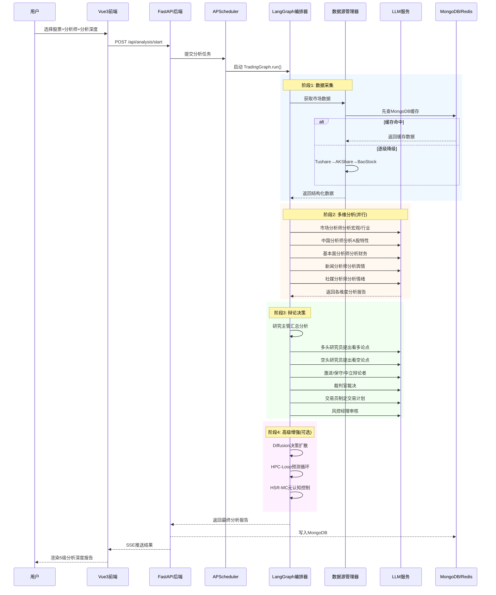

# TradingAgents-CN 项目全景理解文档

> **版本**: v1.0.1 | **最后更新**: 2026-06-09 | **上游**: TauricResearch/TradingAgents

---

## 一、项目概述

### 1.1 项目定位

TradingAgents-CN 是一个面向**中文用户**的**多智能体与大模型股票分析学习平台**。它利用 LangGraph 编排 14 个专业 AI Agent 角色，通过协作辩论完成对单只股票的多维度、多层级分析决策，最终输出结构化的交易建议报告。

**核心价值**: 帮助用户系统化学习如何使用多智能体交易框架与 AI 大模型进行合规的股票研究与策略实验。平台定位为**学习与研究用途**，不提供实盘交易指令。

### 1.2 上游关系

本项目基于 [TauricResearch/TradingAgents](https://github.com/TauricResearch/TradingAgents) 开源框架，在保留其核心多智能体架构的基础上进行了大量增强：

- 从 Streamlit UI 迁移到 **Vue 3 + FastAPI** 全栈架构
- 新增 **A股/港股/美股** 多市场数据源支持
- 新增 **高级 AI 模块**（Diffusion 决策扩散、HPC-Loop 预测循环、L-IWM 可学习世界模型、HSR-MC 元认知控制）
- 新增 **中文深度适配**（中国分析师、中文本地化、国内 LLM 厂商）

### 1.3 许可证结构

| 范围 | 许可证 | 说明 |
|------|--------|------|
| `tradingagents/`、`cli/`、`config/`、`scripts/`、`tests/`、`docs/` 等 | **Apache 2.0** | 开源，可自由使用 |
| `app/`（FastAPI 后端） | **专有许可证** | 需商业授权 |
| `frontend/`（Vue.js 前端） | **专有许可证** | 需商业授权 |

> ⚠️ 个人使用完全开源免费；商业使用必须联系 hsliup@163.com 获取授权。

### 1.4 一句话总结

> 一个将 14 个 AI Agent 角色通过 LangGraph 状态图编排协作，对 A股/港股/美股 进行从数据采集→多维分析→辩论决策→报告输出的全链路智能股票分析平台。

---

## 二、技术架构全景

### 2.1 六层架构图

```
┌──────────────────────────────────────────────────────────────────┐
│                    🖥️  第1层：前端展示层                          │
│  Vue 3 + TypeScript + Element Plus + ECharts + Pinia             │
│  26个页面 · 3个Store · 23个API模块 · 认证守卫 · NProgress       │
├──────────────────────────────────────────────────────────────────┤
│                    🔗  第2层：API网关层                           │
│  FastAPI + Uvicorn · 35+ 路由 · 5个中间件                        │
│  JWT认证 · CORS · 请求重试 · SSE/WebSocket实时推送              │
├──────────────────────────────────────────────────────────────────┤
│                    🧠  第3层：LangGraph编排层                     │
│  StateGraph 多Agent工作流 · 条件路由 · 状态传播 · 反思机制       │
│  14个Agent角色管线 · 双LLM模式(快速/深度思考)                    │
├──────────────────────────────────────────────────────────────────┤
│                    📊  第4层：数据&LLM层                          │
│  ┌─────────────┐  ┌──────────────────────────────────┐          │
│  │ 数据流层     │  │ LLM集成层                        │          │
│  │ 全链路降级   │  │ 双路径(adapters + clients)       │          │
│  │ 4层缓存体系  │  │ 10+Provider · OpenAI兼容模式     │          │
│  └─────────────┘  └──────────────────────────────────┘          │
├──────────────────────────────────────────────────────────────────┤
│                    🔬  第5层：高级AI模块层                        │
│  Diffusion决策扩散 · HPC-Loop预测循环                            │
│  L-IWM可学习世界模型 · HSR-MC元认知控制器                        │
├──────────────────────────────────────────────────────────────────┤
│                    ⚙️  第6层：基础设施层                          │
│  MongoDB + Redis · Docker 5服务 · GitHub Actions CI/CD           │
│  Nginx反向代理 · APScheduler · 多架构(amd64/arm64)              │
└──────────────────────────────────────────────────────────────────┘
```

### 2.2 关键数据流向

```
用户选择股票 → FastAPI接收请求 → APScheduler调度任务
  → LangGraph启动Agent管线
    → 数据源管理器获取数据(CN: MongoDB→Tushare→AKShare→BaoStock)
    → 分析师团队并行分析(市场/中国/基本面/新闻/社媒)
    → 研究主管汇总 → 多头/空头辩论 → 裁判官裁决
    → 交易员制定计划 → 风控经理审核
    → (可选) 高级AI模块增强决策
  → 结果写入MongoDB → 通过SSE/WebSocket推送到前端
  → Vue3渲染分析报告(5级分析深度)
```

---

## 三、核心业务流程

### 3.1 完整交易分析决策流程（Mermaid 时序图）



### 3.2 关键环节对应文件

| 环节 | 关键文件 | 核心职责 |
|------|----------|----------|
| Agent 管线编排 | [`trading_graph.py`](tradingagents/graph/trading_graph.py:1) | 构建 StateGraph，控制 14 Agent 流转 |
| 条件路由 | [`conditional_logic.py`](tradingagents/graph/conditional_logic.py:1) | 根据分析结果决定下一步 Agent |
| 状态传播 | [`propagation.py`](tradingagents/graph/propagation.py:1) | Agent 间消息传递与上下文管理 |
| 反思机制 | [`reflection.py`](tradingagents/graph/reflection.py:1) | 对分析结果进行元评价 |
| 数据获取 | [`data_source_manager.py`](tradingagents/dataflows/data_source_manager.py:1) | 多源全链路降级 |
| LLM 调用 | [`trading_graph.py:create_llm_by_provider`](tradingagents/graph/trading_graph.py:43) | 统一 LLM 创建入口 |

---

## 四、技术栈速览

| 层级 | 技术 | 版本/说明 |
|------|------|-----------|
| **前端框架** | Vue 3 + TypeScript | Composition API，`<script setup>` |
| **构建工具** | Vite 5 | 快速 HMR，ESBuild |
| **UI 组件库** | Element Plus | 企业级 Vue 3 组件库 |
| **图表** | ECharts 5 | 交互式数据可视化 |
| **状态管理** | Pinia | Vue 3 官方推荐 |
| **路由** | Vue Router 4 | 认证守卫 + NProgress |
| **后端框架** | FastAPI + Uvicorn | Python ≥ 3.10 |
| **编排引擎** | LangGraph ≥ 0.4.8 | StateGraph 多 Agent 工作流 |
| **LLM 集成** | LangChain + 自研 Clients | 10+ Provider 支持 |
| **数据库** | MongoDB 4.4 + Motor | 文档/缓存/配置存储 |
| **缓存** | Redis 6.2+ | 会话/临时数据/消息队列 |
| **任务调度** | APScheduler 3.10+ | 异步分析任务 |
| **认证** | PyJWT + bcrypt | Token 自动刷新 |
| **实时推送** | SSE + WebSocket | 分析进度/通知 |
| **数据源** | Tushare/AKShare/BaoStock/YFinance | 多市场覆盖 |
| **容器化** | Docker + docker-compose | 5 服务编排 |
| **CI/CD** | GitHub Actions | 多架构构建发布 |
| **CLI 工具** | Typer + Rich | 交互式命令行 |

---

## 五、模块深度解析

### 5.1 多智能体交易框架 (`tradingagents/`)

#### 5.1.1 Agent 角色体系 (14 个角色)

| # | 角色 | 文件位置 | 职责 | 类型 |
|---|------|----------|------|------|
| 1 | 市场分析师 | [`market_analyst.py`](tradingagents/agents/analysts/market_analyst.py:1) | 宏观趋势、行业动态分析 | 分析师 |
| 2 | 中国分析师 | [`china_market_analyst.py`](tradingagents/agents/analysts/china_market_analyst.py:1) | A股特性、政策面分析 | 分析师 |
| 3 | 基本面分析师 | [`fundamentals_analyst.py`](tradingagents/agents/analysts/fundamentals_analyst.py:1) | 财务数据、商业模式 | 分析师 |
| 4 | 新闻分析师 | [`news_analyst.py`](tradingagents/agents/analysts/news_analyst.py:1) | 新闻舆情、公告影响 | 分析师 |
| 5 | 社媒分析师 | [`social_media_analyst.py`](tradingagents/agents/analysts/social_media_analyst.py:1) | 投资者情绪、舆论导向 | 分析师 |
| 6 | 研究主管 | `agents/managers/` | 汇总分析、分配任务 | 管理者 |
| 7 | 多头研究员 | `agents/researchers/` | 看多论点研究 | 研究员 |
| 8 | 空头研究员 | `agents/researchers/` | 看空论点研究 | 研究员 |
| 9 | 裁判官 | `agents/managers/` | 裁决多空辩论 | 决策者 |
| 10 | 交易员 | [`trader/`](tradingagents/agents/trader/:1) | 制定具体交易计划 | 执行者 |
| 11-13 | 激进/保守/中立辩论者 | `agents/researchers/` | 多角度辩论 | 辩论者 |
| 14 | 风控经理 | [`risk_mgmt/`](tradingagents/agents/risk_mgmt/:1) | 交易计划审核、风险控制 | 审核者 |

#### 5.1.2 LangGraph 图拓扑

```
                    ┌─────────────────────┐
                    │    开始节点          │
                    └────────┬────────────┘
                             │
              ┌──────────────┼──────────────┐
              ▼              ▼              ▼
        ┌──────────┐  ┌──────────┐  ┌──────────┐
        │市场分析师 │  │中国分析师 │  │基本面分析│  ...并行分析层
        └────┬─────┘  └────┬─────┘  └────┬─────┘
              └──────────────┼──────────────┘
                             ▼
                    ┌───────────────┐
                    │   研究主管     │  ← 汇总层
                    └───────┬───────┘
                            │
              ┌─────────────┼─────────────┐
              ▼             ▼             ▼
        ┌──────────┐  ┌──────────┐  ┌──────────┐
        │多头研究员 │  │空头研究员 │  │ 辩论者组  │  ← 辩论层
        └────┬─────┘  └────┬─────┘  └────┬─────┘
              └─────────────┼─────────────┘
                            ▼
                    ┌───────────────┐
                    │    裁判官      │  ← 裁决层
                    └───────┬───────┘
                            ▼
                    ┌───────────────┐
                    │    交易员      │  ← 执行层
                    └───────┬───────┘
                            ▼
                    ┌───────────────┐
                    │   风控经理     │  ← 审核层
                    └───────┬───────┘
                            ▼
              ┌─────────────────────────┐
              │  高级AI模块 (可选增强)   │  ← 增强层
              │  Diffusion / HPC-Loop   │
              │  L-IWM / HSR-MC         │
              └─────────────┬───────────┘
                            ▼
                    ┌───────────────┐
                    │    结束节点    │
                    └───────────────┘
```

**核心机制**：
- **并行分析**: 5 个分析师同时工作，各自独立调用 LLM
- **条件路由**: [`conditional_logic.py`](tradingagents/graph/conditional_logic.py:1) 根据分析结果动态决定是否触发辩论或直接进入交易计划
- **反思回路**: [`reflection.py`](tradingagents/graph/reflection.py:1) 对关键决策点进行二次验证

#### 5.1.3 数据流全链路降级策略

```
请求数据
  │
  ▼
┌──────────┐  命中  ┌──────────┐
│  Redis   │──────▶│ 直接返回  │
│ L1 缓存  │       └──────────┘
└────┬─────┘
  │ 未命中
  ▼
┌──────────┐  命中  ┌──────────┐
│ MongoDB  │──────▶│ 回写Redis │
│ L2 缓存  │       └──────────┘
└────┬─────┘
  │ 未命中
  ▼
┌──────────┐  命中  ┌──────────┐
│ 文件缓存  │──────▶│ 回写Mongo │
│ L3 缓存  │       └──────────┘
└────┬─────┘
  │ 未命中
  ▼
┌──────────────────────────────────────┐
│         在线数据源 (顺序降级)          │
│  ┌──────────┐  ┌──────────┐  ┌──────┐│
│  │ Tushare  │─▶│ AKShare  │─▶│BaoStk││
│  │ (付费优先)│  │ (免费备选)│  │(兜底)││
│  └──────────┘  └──────────┘  └──────┘│
└──────────────────────────────────────┘
```

该策略定义在 [`data_source_manager.py`](tradingagents/dataflows/data_source_manager.py:1) (2590 行)，确保在任何数据源失效时都能获得数据。

#### 5.1.4 LLM 集成双路径架构

```
                    ┌──────────────────────┐
                    │   TradingGraph       │
                    │   create_llm_by_     │
                    │   provider()         │
                    └──────────┬───────────┘
                               │
              ┌────────────────┼────────────────┐
              ▼                                 ▼
    ┌─────────────────┐              ┌─────────────────┐
    │  旧路径          │              │  新路径          │
    │  llm_adapters/   │              │  llm_clients/    │
    │  LangChain原生   │              │  自研工厂模式    │
    └────────┬────────┘              └────────┬────────┘
             │                                 │
             └──────────────┬──────────────────┘
                            ▼
              ┌─────────────────────────┐
              │   10+ LLM Provider       │
              │  OpenAI · Anthropic      │
              │  Google · DeepSeek       │
              │  Qwen · GLM · 千帆       │
              │  OpenRouter · AiHubMix   │
              │  Ollama · SiliconFlow    │
              └─────────────────────────┘
```

**关键特性**:
- **双模型策略**: 快速思考模型（轻量任务）+ 深度思考模型（复杂推理）
- **混合厂商模式**: 快速/深度模型可来自不同厂商（如 DeepSeek 快速 + OpenAI 深度）
- **OpenAI 兼容模式**: 任何兼容 OpenAI API 的自定义厂商均可接入
- **API Key 三级来源**: 数据库配置 → 环境变量 → 默认值

入口函数: [`create_llm_by_provider()`](tradingagents/graph/trading_graph.py:43)

#### 5.1.5 高级 AI 模块关系图

```
┌─────────────────────────────────────────────────────┐
│                 高级 AI 模块层                        │
│                                                      │
│  ┌──────────────┐    ┌──────────────┐               │
│  │  Diffusion    │    │  HPC-Loop    │               │
│  │  决策扩散      │    │  预测循环     │               │
│  │  纯NumPy实现   │    │  迭代预测     │               │
│  └──────┬───────┘    └──────┬───────┘               │
│         │                    │                       │
│         └────────┬───────────┘                       │
│                  ▼                                   │
│         ┌──────────────┐                            │
│         │   L-IWM      │                            │
│         │   可学习世界   │                            │
│         │   模型        │                            │
│         └──────┬───────┘                            │
│                │                                     │
│                ▼                                     │
│         ┌──────────────┐                            │
│         │   HSR-MC     │                            │
│         │   元认知控制器 │                            │
│         │   最终决策仲裁 │                            │
│         └──────────────┘                            │
└─────────────────────────────────────────────────────┘
```

- **Diffusion**: [`tradingagents/diffusion/`](tradingagents/diffusion/:1) — 纯 NumPy 决策扩散模型，无需 GPU
- **HPC-Loop**: [`tradingagents/hpc_loop/`](tradingagents/hpc_loop/:1) — 分层预测一致性循环
- **L-IWM**: [`tradingagents/l_iwm/`](tradingagents/l_iwm/:1) — 可学习内部世界模型
- **HSR-MC**: [`tradingagents/hsrc_mc/`](tradingagents/hsrc_mc/:1) — 分层自反思元认知

### 5.2 FastAPI 后端服务 (`app/`)

#### 5.2.1 API 路由分类 (35+ 路由)

| 分类 | 路由文件 | 主要端点 |
|------|----------|----------|
| **分析核心** | [`analysis.py`](app/routers/analysis.py:1) | 启动/查询/取消分析、5级分析深度 |
| **股票数据** | [`stocks.py`](app/routers/stocks.py:1)、[`stock_data.py`](app/routers/stock_data.py:1) | 股票搜索、基本信息、市场行情 |
| **数据同步** | [`stock_sync.py`](app/routers/stock_sync.py:1)、[`sync.py`](app/routers/sync.py:1) | 单股/批量同步、多源同步 |
| **收藏管理** | [`favorites.py`](app/routers/favorites.py:1) | 收藏CRUD、标签管理 |
| **报告管理** | [`reports.py`](app/routers/reports.py:1) | 报告查询、导出、历史 |
| **认证系统** | [`auth_db.py`](app/routers/auth_db.py:1) | 登录/注册/Token刷新 |
| **配置管理** | [`config.py`](app/routers/config.py:1)、[`system_config.py`](app/routers/system_config.py:1) | LLM配置、系统设置 |
| **实时推送** | [`sse.py`](app/routers/sse.py:1)、[`websocket_notifications.py`](app/routers/websocket_notifications.py:1) | SSE进度、WebSocket通知 |
| **调度管理** | [`scheduler.py`](app/routers/scheduler.py:1) | 定时任务管理 |
| **健康检查** | [`health.py`](app/routers/health.py:1) | 服务健康状态 |

#### 5.2.2 服务层架构

```
app/
├── routers/        ← 35+ API路由
├── services/       ← 业务逻辑层
├── models/         ← MongoDB数据模型
├── schemas/        ← Pydantic请求/响应模式
├── middleware/     ← 5个中间件
│   ├── 认证中间件
│   ├── CORS中间件
│   ├── 日志中间件
│   ├── 请求追踪中间件
│   └── 错误处理中间件
├── core/           ← 核心配置
├── constants/      ← 常量定义
├── worker/         ← 后台任务Worker
└── utils/          ← 工具函数
```

#### 5.2.3 分析任务生命周期

```
[创建] → [排队] → [执行中] → [完成/失败]
  │                   │
  │                   ├── SSE 实时推送进度
  │                   ├── WebSocket 推送通知
  │                   └── 结果写入 MongoDB
  │
  └── APScheduler 管理任务队列
      支持: 暂停/恢复/取消/重试
```

### 5.3 Vue.js 前端应用 (`frontend/`)

#### 5.3.1 路由与视图映射 (26 个页面)

| 路由 | 视图组件 | 功能 |
|------|----------|------|
| `/dashboard` | [`Dashboard/index.vue`](frontend/src/views/Dashboard/index.vue:1) (1072行) | 系统仪表板 |
| `/analysis/single` | [`SingleAnalysis.vue`](frontend/src/views/Analysis/SingleAnalysis.vue:1) (3540行) | 单股分析核心页 |
| `/analysis/batch` | `BatchAnalysis.vue` | 批量分析 |
| `/screening` | `StockScreening.vue` | 股票筛选 |
| `/favorites` | [`Favorites/index.vue`](frontend/src/views/Favorites/index.vue:1) (1270行) | 收藏管理 |
| `/reports` | 报告列表/详情 | 历史报告浏览 |
| `/learning` | 学习中心 | 教程/论文阅读 |
| `/config` | 系统配置 | LLM配置向导 |
| `/admin` | 管理后台 | 用户/系统管理 |

#### 5.3.2 状态管理架构 (3 个 Pinia Store)

```
┌─────────────────────────────────────────┐
│              Pinia Stores                │
│                                          │
│  ┌──────────────┐  ┌──────────────┐     │
│  │  authStore   │  │  appStore    │     │
│  │  认证状态     │  │  应用偏好     │     │
│  │  Token管理   │  │  主题/语言   │     │
│  │  自动刷新     │  │  侧边栏状态  │     │
│  └──────────────┘  └──────────────┘     │
│                                          │
│  ┌──────────────────────────────┐       │
│  │     notificationStore        │       │
│  │     WebSocket实时通知         │       │
│  │     分析进度/系统消息         │       │
│  └──────────────────────────────┘       │
└─────────────────────────────────────────┘
```

#### 5.3.3 前后端交互流程

```
Vue3前端                         FastAPI后端
────────                         ──────────
Axios实例(统一配置)
  │
  ├── 请求拦截器
  │   ├── 自动注入 JWT Token
  │   ├── 请求重试(指数退避)
  │   └── Token过期自动刷新
  │
  ├── 23个API模块 ─────HTTP/REST────▶ 35+路由端点
  │   ├── analysis.ts                    ├── /api/analysis/*
  │   ├── stocks.ts                      ├── /api/stocks/*
  │   ├── favorites.ts                   ├── /api/favorites/*
  │   ├── auth.ts                        ├── /api/auth/*
  │   ├── config.ts                      ├── /api/config/*
  │   └── ...                            └── ...
  │
  ├── SSE客户端 ◀──Server-Sent Events── 分析进度推送
  └── WebSocket ◀─────WebSocket─────── 系统通知推送
```

**关键组件**:
- [`ConfigWizard.vue`](frontend/src/components/ConfigWizard.vue:1): 首次使用 LLM 配置向导
- `MarketSelector.vue`: 多市场（A股/港股/美股）选择器
- `SidebarMenu.vue`: 侧边栏导航菜单

### 5.4 运维与工具链

#### 5.4.1 Scripts 体系 (~200+ 脚本，19 个子目录)

| 目录 | 用途 | 典型脚本 |
|------|------|----------|
| `scripts/` 根目录 | 数据同步/诊断/修复 | [`add_baostock_to_db.py`](scripts/add_baostock_to_db.py:1) |
| `scripts/docker/` | Docker 部署辅助 | 初始化、清理、切换环境 |
| `scripts/install/` | 安装配置 | Windows/Linux 安装脚本 |
| `scripts/dev/` | 开发辅助 | 语法检查、日志分析 |
| `scripts/data_sync/` | 数据同步专项 | 批量同步、增量更新 |
| `scripts/diagnosis/` | 诊断工具 | 环境检测、配置验证 |
| `scripts/migration/` | 数据迁移 | 认证迁移、配置迁移 |

#### 5.4.2 CLI 工具

[`cli/main.py`](cli/main.py:1) (2057 行) 基于 **Typer + Rich** 构建，支持 7 个子命令：

| 子命令 | 功能 |
|--------|------|
| `analyze` | 交互式股票分析 |
| `config` | 配置管理 |
| `sync` | 数据同步 |
| `report` | 报告查看/导出 |
| `user` | 用户管理 |
| `system` | 系统维护 |
| `serve` | 启动旧版 Streamlit Web |

#### 5.4.3 Docker 部署架构

```
                    ┌─────────────────┐
                    │   Nginx (可选)   │
                    │   反向代理       │
                    │   端口 80/443    │
                    └────────┬────────┘
                             │
              ┌──────────────┼──────────────┐
              ▼                             ▼
    ┌─────────────────┐          ┌─────────────────┐
    │  Frontend容器    │          │  Backend容器     │
    │  Vue3 + Nginx   │          │  FastAPI:8000   │
    │  端口:3000       │          │  Worker:后台     │
    └─────────────────┘          └────────┬────────┘
                                          │
                         ┌────────────────┼────────────────┐
                         ▼                                 ▼
               ┌─────────────────┐              ┌─────────────────┐
               │  MongoDB容器     │              │  Redis容器       │
               │  mongo:4.4      │              │  redis:alpine   │
               │  端口:27017      │              │  端口:6379       │
               └─────────────────┘              └─────────────────┘
```

**5 个服务**: backend / frontend / mongodb / redis / nginx(可选)

**多架构支持**: amd64 + arm64，通过 [`docker-compose.hub.nginx.arm.yml`](docker-compose.hub.nginx.arm.yml:1) 分别配置。

#### 5.4.4 CI/CD

GitHub Actions 工作流：代码检查 → 多架构 Docker 构建 → 推送到容器仓库 → 部署通知。

---

## 六、项目规模统计

| 维度 | 数据 |
|------|------|
| **总文件数** | ~3000+ |
| **Python 模块** | ~500+ (tradingagents/ + app/ + cli/) |
| **核心编排器** | [`trading_graph.py`](tradingagents/graph/trading_graph.py:1) — 1341 行 |
| **数据源管理器** | [`data_source_manager.py`](tradingagents/dataflows/data_source_manager.py:1) — 2590 行 |
| **CLI 工具** | [`main.py`](cli/main.py:1) — 2057 行 |
| **前端核心页面** | SingleAnalysis (3540行)、Favorites (1270行)、Dashboard (1072行) |
| **API 路由** | 35+ 端点 |
| **Agent 角色** | 14 个 |
| **LLM Provider** | 10+ |
| **直接依赖** | 88 个 (pyproject.toml) |
| **环境变量** | 40+ (.env.example) |
| **脚本** | ~200+ |
| **测试** | ~175 个 (pytest) |
| **文档** | ~440+ 篇 |
| **前端页面** | 26 个路由 |
| **Pinia Store** | 3 个 |
| **API 模块** | 23 个 |

---

## 七、架构决策与设计模式

### 7.1 关键架构决策 (ADR)

| # | 决策 | 背景 | 影响 |
|---|------|------|------|
| ADR-1 | **从 Streamlit → Vue3+FastAPI** | 旧 Streamlit 无法满足复杂交互需求 | 前后端分离，专业全栈架构 |
| ADR-2 | **LangGraph StateGraph 编排** | 需要灵活的多Agent条件路由 | 支持动态Agent管线、条件分支、回路 |
| ADR-3 | **双LLM模式(快速+深度)** | 不同任务对模型要求不同 | 成本优化，简单任务用轻量模型 |
| ADR-4 | **全链路数据降级** | 国内数据源不稳定 | 确保数据可用性，逐级回退 |
| ADR-5 | **混合许可证** | 保护专有价值同时回馈社区 | 核心开源，前后端专有 |
| ADR-6 | **MongoDB为主存储** | 文档型数据、灵活Schema | 适合非结构化分析报告存储 |
| ADR-7 | **高级AI模块可选集成** | 实验性功能不应阻塞主流程 | 模块松耦合，独立开关 |

### 7.2 使用的设计模式

| 模式 | 应用场景 |
|------|----------|
| **工厂模式** | [`factory.py`](tradingagents/llm_clients/factory.py:1) — LLM Client 统一创建 |
| **策略模式** | 数据源降级链、LLM Provider 切换 |
| **观察者模式** | SSE/WebSocket 实时推送分析进度 |
| **状态模式** | LangGraph AgentState 多阶段流转 |
| **模板方法** | Agent 基类定义分析流程骨架 |
| **责任链** | 中间件层 (认证→CORS→日志→追踪→错误) |
| **适配器模式** | `llm_adapters/` — 统一不同 LLM SDK 接口 |

### 7.3 已知技术债务

| 项目 | 说明 | 状态 |
|------|------|------|
| **LLM 双路径并存** | `llm_adapters/` 与 `llm_clients/` 功能重叠 | 逐步迁移到新路径 |
| **旧 Streamlit Web** | `web/` 目录仍保留 | 已被 Vue3 替代，待清理 |
| **测试覆盖不均衡** | 集成测试默认跳过 | 需加强 CI 集成测试 |
| **配置分散** | 环境变量 + MongoDB + 文件三种配置源 | 建议统一到数据库 |
| **文档数量庞大** | ~440+ 文档，部分过时 | 需要整理归档 |

---

## 八、项目的独特价值

### 8.1 相比上游原版的增强点

| 维度 | 上游 (TauricResearch) | TradingAgents-CN |
|------|----------------------|-------------------|
| **UI** | Streamlit (Python) | Vue 3 + Element Plus (SPA) |
| **后端** | 无独立后端 | FastAPI RESTful API |
| **数据库** | 文件系统 | MongoDB + Redis |
| **数据源** | 美股为主 (Yahoo Finance) | A股全链路降级 (Tushare/AKShare/BaoStock) |
| **LLM 厂商** | OpenAI/Anthropic | 10+ 国内外厂商 (含通义千问/GLM/千帆) |
| **分析维度** | 单一美股视角 | 中国分析师独立角色 |
| **部署方式** | pip install | Docker 5 服务编排 + 多架构 |
| **高级AI** | 无 | Diffusion + HPC-Loop + L-IWM + HSR-MC |
| **中文支持** | 无 | 全中文界面/文档/分析报告 |

### 8.2 中文市场的适配策略

1. **数据源适配**: 国内数据源优先（Tushare → AKShare → BaoStock），覆盖 A股/港股 L1/L2 数据
2. **LLM 适配**: 国内厂商深度集成（通义千问、GLM、DeepSeek），支持 OpenAI 兼容自定义端点
3. **分析维度**: 新增"中国分析师"角色，专注 A股特有的政策面、资金面分析
4. **运维适配**: 国内镜像加速、Windows 安装脚本、中文文档体系

### 8.3 高级 AI 模块的创新性

- **Diffusion 决策扩散**: 纯 NumPy 实现，无需 GPU，将扩散模型应用于金融决策推理
- **HPC-Loop**: 分层预测一致性循环，通过迭代预测来校准 Agent 判断
- **L-IWM**: 可学习内部世界模型，构建市场环境的内部表征
- **HSR-MC**: 分层自反思元认知控制器，对 Agent 决策进行元级别监控和修正

---

## 九、快速上手指南

### 9.1 环境要求

| 组件 | 最低要求 | 推荐 |
|------|----------|------|
| **Python** | ≥ 3.10 | 3.11+ |
| **Node.js** | ≥ 18 | 20 LTS |
| **Docker** | 20.10+ | 24+ |
| **Docker Compose** | 2.0+ | 2.20+ |
| **MongoDB** | 4.4 | 4.4 (Docker 内置) |
| **Redis** | 6.2+ | 7.x (Docker 内置) |
| **操作系统** | Windows 10+ / macOS 12+ / Ubuntu 20.04+ | — |

### 9.2 最小配置

编辑 `.env` 文件，至少配置一个 LLM Provider：

```bash
# 必选：至少配置一种 LLM
LLM_PROVIDER=deepseek               # 或 openai / dashscope / google
DEEPSEEK_API_KEY=sk-your-key-here   # 对应 Provider 的 API Key
QUICK_THINK_LLM=deepseek-chat       # 快速思考模型
DEEP_THINK_LLM=deepseek-chat        # 深度思考模型
```

### 9.3 启动步骤 (Docker 方式)

```bash
# 1. 克隆项目
git clone https://github.com/hsliuping/TradingAgents-CN.git
cd TradingAgents-CN

# 2. 配置环境变量
cp .env.example .env
# 编辑 .env，填入 LLM API Key

# 3. 一键启动
docker-compose up -d

# 4. 访问
# 前端: http://localhost:3000
# 后端API文档: http://localhost:8000/docs
```

### 9.4 启动步骤 (本地开发方式)

```bash
# 1. 后端
pip install -e .
cd app
uvicorn main:app --reload --port 8000

# 2. 前端 (新终端)
cd frontend
npm install
npm run dev

# 3. 访问
# 前端: http://localhost:5173
# 后端: http://localhost:8000
```

> 📚 详细文档请参阅 [`docs/`](docs/:1) 目录下的 440+ 篇专题文档。

---

> **文档生成信息**: 本文档基于四份子任务分析报告整合提炼而成，涵盖项目结构、后端架构、前端架构、支持体系四个维度。如有细节需要核实，请参考上方各章节标注的具体文件路径。
