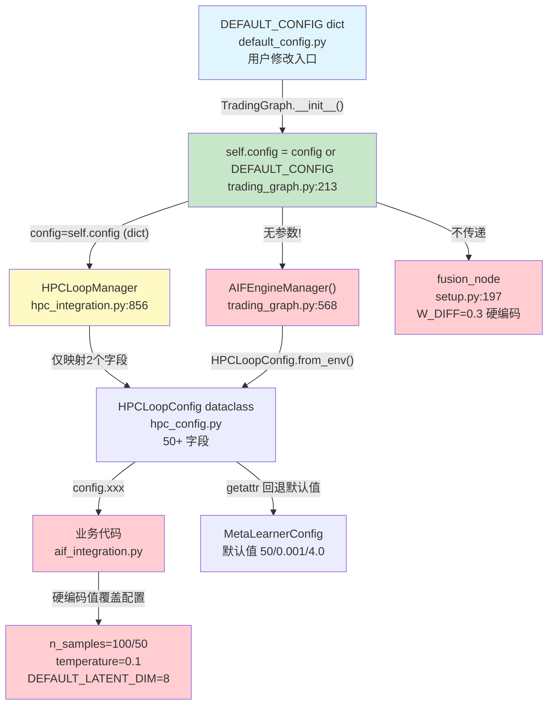
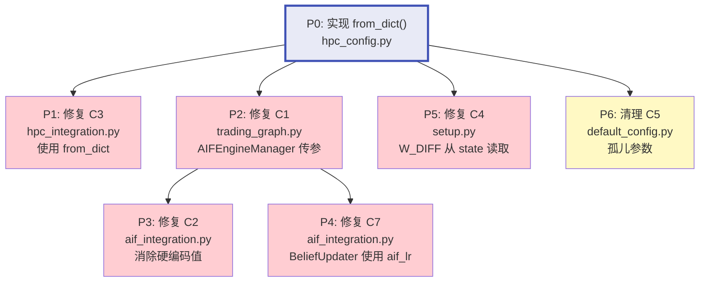

# TradingAgents-CN v1.0.1 — 配置架构深度审查报告

> **审查时间**: 2026-06-17  
> **审查范围**: 配置参数传递架构、硬编码值分析、单一数据源原则  
> **前置报告**: [static-scan-loop1-report-v1.0.1.md](./static-scan-loop1-report-v1.0.1.md)

---

## 目录

1. [架构概览与问题根源分析](#1-架构概览与问题根源分析)
2. [CRITICAL 问题逐一深度分析](#2-critical-问题逐一深度分析)
3. [精确修复方案（含文件路径和行号）](#3-精确修复方案)
4. [修复优先级与依赖关系](#4-修复优先级与依赖关系)
5. [架构改进建议（长期）](#5-架构改进建议)

---

## 1. 架构概览与问题根源分析

### 1.1 当前配置架构



### 1.2 根源剖析：三层脱节

| 层级 | 组件 | 问题本质 |
|------|------|----------|
| **L1: 配置定义层** | `default_config.py` | 纯 dict，无类型安全，无消费追踪 |
| **L2: 配置桥接层** | `hpc_integration.py:856-865` | 映射严重不完整（2/50+字段），几乎等于不存在 |
| **L3: 配置消费层** | `aif_integration.py`, `aif_engine.py`, `setup.py` | 硬编码值覆盖配置，模块级常量替代参数 |

**核心矛盾**: 系统中存在两套配置系统——

| 维度 | `DEFAULT_CONFIG` (dict) | `HPCLoopConfig` (dataclass) |
|------|------------------------|---------------------------|
| 定位 | 面向用户的配置入口 | 面向 HPC-Loop 子系统的配置 |
| 类型安全 | ❌ 无 | ✅ dataclass 字段类型 |
| 环境变量支持 | ✅ `_apply_env_overrides` | ✅ `from_env()` |
| 参数消费率 | ~30% 被实际消费 | ~100%（但默认值覆盖用户设置） |
| 两者值一致性 | ❌ 8个参数值不同 | ❌ 4个参数命名不同 |

**当前没有任何机制将 L1 的值正确传递到 L2，用户对 `DEFAULT_CONFIG` 的修改被架空。**

---

## 2. CRITICAL 问题逐一深度分析

### 2.1 C1: AIFEngineManager 构造时未传入 config — 所有 AIF 参数修改失效

| 属性 | 详情 |
|------|------|
| **文件** | [`tradingagents/graph/trading_graph.py:568`](../../tradingagents/graph/trading_graph.py:568) |
| **严重性** | 🔴 CRITICAL |
| **影响范围** | 4 个 AIF 参数：`aif_latent_dim`, `aif_n_samples`, `aif_learning_rate`, `aif_efe_temperature` |

#### 断裂点分析

```
trading_graph.py:213  self.config = config or DEFAULT_CONFIG (dict)
         │
         ├─→ trading_graph.py:560  HPCLoopManager(config=self.config)  ← 有传 config
         │          └→ hpc_integration.py:856  __init__(config=self.config)
         │                  └→ 仅映射 hpc_loop_enabled, use_aif_engine (2/50+ 字段)
         │
         └─→ trading_graph.py:568  AIFEngineManager()  ← ❌ 无参数！
                     └→ aif_integration.py:927  self.config = config or HPCLoopConfig.from_env()
                              └→ 使用 hpc_config.py 默认值，忽略 DEFAULT_CONFIG
```

#### 具体差异

| 参数 | `default_config.py` (用户期望) | `hpc_config.py` (实际生效) | 差异 |
|------|------|------|------|
| `aif_latent_dim` | 6 | 8 | -25% |
| `aif_n_samples` | 200 | 100 | -50% |
| `aif_learning_rate` | 0.005 | 0.01 | +100% |
| `aif_efe_temperature` | 1.2 | 1.0 | -17% |

### 2.2 C2: AIF 核心参数在 aif_integration.py 中被硬编码覆盖

| 属性 | 详情 |
|------|------|
| **文件** | [`tradingagents/hpc_loop/aif_integration.py`](../../tradingagents/hpc_loop/aif_integration.py) |
| **严重性** | 🔴 CRITICAL |
| **影响范围** | 即使 C1 修复后，以下硬编码仍会覆盖配置 |

#### 硬编码清单

| 位置 | 硬编码 | 配置对应 | 问题 |
|------|--------|----------|------|
| `aif_integration.py:156` | `n_samples=100` | `aif_n_samples: 200` | 生成模型预测采样数被固定为100 |
| `aif_integration.py:416` | `state.get("aif_efe_samples", 50)` | `aif_n_samples: 200` | EFE 计算默认采样50，仅为配置的25% |
| `aif_integration.py:417` | `state.get("aif_action_temperature", 0.1)` | `aif_efe_temperature: 1.2` | 温度参数差12倍！探索-利用平衡完全错位 |
| `aif_integration.py:738` | `n_samples=50` | `aif_n_samples: 200` | fusion 节点中 EFE 计算采样数硬编码 |
| `aif_integration.py:975` | `latent_dim=DEFAULT_LATENT_DIM` | `aif_latent_dim: 6` | 使用 `aif_engine.py:74` 的模块常量 `DEFAULT_LATENT_DIM=8` |

**关键洞察**: 即使修复 C1（传参问题），C2 的硬编码会在**最终调用处**覆盖传入的配置值。必须同时修复 C1 和 C2。

### 2.3 C3: HPCLoopManager 的 dict→dataclass 映射不完整

| 属性 | 详情 |
|------|------|
| **文件** | [`tradingagents/hpc_loop/hpc_integration.py:856-865`](../../tradingagents/hpc_loop/hpc_integration.py:856-865) |
| **严重性** | 🔴 CRITICAL |
| **影响范围** | 所有 HPC 参数（约20+个字段） |

#### 当前映射（仅2个字段）

```python
# hpc_integration.py:856-865 — 当前实现
if isinstance(config, HPCLoopConfig):
    self.config = config
elif config:
    hpc_config = HPCLoopConfig.from_env()
    if "hpc_loop_enabled" in config:        # ✅ 有映射
        hpc_config.enabled = config["hpc_loop_enabled"]
    if "use_aif_engine" in config:           # ✅ 有映射
        hpc_config.use_aif_engine = config["use_aif_engine"]
    self.config = hpc_config                 # ❌ 其余50+字段全部丢失
```

#### 丢失的关键字段（与 C5 孤儿参数关联）

| `default_config.py` 键 | `HPCLoopConfig` 字段 | 映射状态 |
|------------------------|---------------------|---------|
| `hpc_prediction_error_threshold` | `prediction_error_surprise_threshold` | ❌ 命名不同+无映射 |
| `hpc_prediction_error_rate` | **不存在** | ❌ 完全孤儿 |
| `hpc_gws_enabled` | `gws_enabled` | ❌ 无映射 |
| `hpc_memory_window_size` | `generative_model_history_window` | ❌ 命名不同+无映射 |
| `hpc_parallel_analysts` | `parallel_analysts` | ❌ 无映射 |
| `hpc_causal_max_hypotheses` | `causal_graph_max_nodes` | ❌ 命名不同+无映射 |
| `l_iwm_enabled` | `l_iwm_enabled` | ❌ 无映射 |
| `hsrc_mc_enabled` | `hsrc_mc_enabled` | ❌ 无映射 |

### 2.4 C4: W_DIFF=0.3 硬编码 vs diffusion_weight=0.4

| 属性 | 详情 |
|------|------|
| **文件** | [`tradingagents/graph/setup.py:197`](../../tradingagents/graph/setup.py:197) |
| **严重性** | 🔴 CRITICAL |
| **影响范围** | 扩散决策融合权重 |

#### 代码现状

```python
# setup.py:197 — 文件级常量，完全脱离配置系统
W_DIFF = 0.3  # 扩散决策融合权重

def fusion_node(state) -> dict:
    # ...
    diff_weight = W_DIFF * diff_confidence  # 直接用硬编码常量
```

#### 配置侧

```python
# default_config.py:236
"diffusion_weight": 0.4,  # 用户修改此值完全无效
```

#### 修复难点

`fusion_node` 是一个纯函数（LangGraph 节点），其签名是 `(state) -> dict`。要让 `W_DIFF` 可配置，有两种策略：

1. **通过 state 传递**: 在调用 `fusion_node` 前将 `diffusion_weight` 注入 `state`
2. **模块级配置注入**: 在模块初始化时设置 `W_DIFF`（但可能引入全局状态）

推荐方案1，因为避免全局可变状态，与 LangGraph 的 state 哲学一致。

### 2.5 C5: 孤儿配置参数

| 属性 | 详情 |
|------|------|
| **文件** | [`tradingagents/default_config.py:212-217`](../../tradingagents/default_config.py:212-217) |

#### 孤儿参数表

| 参数 | 代码搜索命中次数（业务代码） | 建议处理 |
|------|---------------------------|---------|
| `hpc_prediction_error_threshold` (1.5) | 0 | 映射到 `prediction_error_surprise_threshold` |
| `hpc_prediction_error_rate` (0.15) | 0 | **删除**（`HPCLoopConfig` 中无对应字段） |
| `hpc_memory_window_size` (150) | 0 | 映射到 `generative_model_history_window` |
| `hpc_causal_max_hypotheses` (30) | 0 | 映射到 `causal_graph_max_nodes` |

### 2.6 C7: aif_learning_rate 被 generative_model_learning_rate 替代

| 属性 | 详情 |
|------|------|
| **文件** | [`tradingagents/hpc_loop/aif_integration.py:1003`](../../tradingagents/hpc_loop/aif_integration.py:1003) |

```python
# aif_integration.py:1003 — BeliefUpdater 使用 generative_model_learning_rate
self.belief_updater = BeliefUpdater(
    generative_model=self.generative_model,
    learning_rate=self.config.generative_model_learning_rate,  # ← 不是 aif_learning_rate
    use_svi=False,
)
```

**问题**: 用户修改 `aif_learning_rate: 0.005` 不会影响信念更新器。必须修改 `generative_model_learning_rate: 0.01` 才生效。这是**参数语义错位**——AIF 引擎的信念更新学习率应该使用 AIF 专属参数。

---

## 3. 精确修复方案

### 3.0 核心前提：建立统一的 dict→dataclass 映射函数

在开始逐个修复前，需要建立一个**集中的映射函数**，作为 `DEFAULT_CONFIG` dict 到 `HPCLoopConfig` dataclass 的唯一桥梁。这是所有后续修复的基础。

#### 新建文件：`tradingagents/config/config_bridge.py`

此文件定义映射函数，解决命名不一致和值覆盖问题。建议在 `tradingagents/config/` 包中创建（该目录已存在且用途匹配）。

##### 方案 A（推荐）：在 `hpc_config.py` 中添加 `from_dict()` 类方法

```python
# hpc_config.py 中新增方法（约在第200行 from_env() 之后）

@classmethod
def from_dict(cls, config_dict: Dict[str, Any]) -> "HPCLoopConfig":
    """
    从 DEFAULT_CONFIG dict 创建 HPCLoopConfig，处理命名差异。
    这是 DEFAULT_CONFIG → HPCLoopConfig 的唯一映射入口。
    """
    config = cls.from_env()  # 先加载环境变量默认值
    
    # === 直接映射（键名一致）===
    _direct_fields = [
        "gws_enabled", "gws_capacity", "gws_saliency_threshold",
        "gws_novelty_weight", "gws_confidence_weight", "gws_impact_weight",
        "gws_urgency_weight", "generative_model_enabled",
        "generative_model_history_window", "generative_model_latent_dim",
        "generative_model_learning_rate", "active_inference_enabled",
        "epistemic_weight", "pragmatic_weight", "exploration_decay",
        "min_exploration_bonus", "causal_inference_enabled",
        "causal_graph_max_nodes", "causal_dag_confidence_threshold",
        "memory_enabled", "memory_hippocampus_max_episodes",
        "memory_consolidation_interval", "memory_replay_batch_size",
        "memory_similarity_top_k", "memory_saliency_threshold",
        "prediction_error_enabled", "prediction_error_surprise_threshold",
        "prediction_error_precision_dynamics", "log_level", "debug_mode",
        "l_iwm_enabled", "l_iwm_config_path", "l_iwm_input_dim",
        "hsrc_mc_enabled", "hsrc_mc_config_path",
        "use_aif_engine", "aif_latent_dim", "aif_n_samples",
        "aif_learning_rate", "aif_efe_temperature",
        "use_hierarchical_model", "meta_cycle_interval",
        "meta_window_size", "meta_learning_rate", "meta_cusum_threshold",
        "enabled", "parallel_analysts",
    ]
    for field_name in _direct_fields:
        if field_name in config_dict:
            setattr(config, field_name, config_dict[field_name])
    
    # === 命名差异映射 ===
    _name_mapping = {
        # default_config.py key          → HPCLoopConfig field
        "hpc_loop_enabled":              "enabled",
        "hpc_parallel_analysts":         "parallel_analysts",
        "hpc_gws_enabled":               "gws_enabled",
        "hpc_prediction_error_threshold": "prediction_error_surprise_threshold",
        "hpc_memory_window_size":        "generative_model_history_window",
        "hpc_causal_max_hypotheses":     "causal_graph_max_nodes",
    }
    for dict_key, field_name in _name_mapping.items():
        if dict_key in config_dict:
            setattr(config, field_name, config_dict[dict_key])
    
    # === hpc_config 子字典映射（如 "hpc_config": {}）===
    if "hpc_config" in config_dict and isinstance(config_dict["hpc_config"], dict):
        for key, value in config_dict["hpc_config"].items():
            if hasattr(config, key):
                setattr(config, key, value)
    
    return config
```

### 3.1 修复 C1：AIFEngineManager 传入配置

| 优先级 | P0（最高） |
|--------|-----------|
| **前提** | 3.0 的 `from_dict()` 方法已实现 |

#### 修改文件1: [`tradingagents/graph/trading_graph.py`](../../tradingagents/graph/trading_graph.py:558-575)

**当前代码（第558-575行）：**
```python
# ========== 三轮改造: 初始化 HPC-Loop 管理器 ==========
self.hpc_loop = HPCLoopManager(config=self.config)
if self.hpc_loop.enabled:
    logger.info("[HPC] HPC-Loop enabled")

# ========== AIF 引擎初始化 ==========
self.aif_engine = None
if self.config.get("use_aif_engine", True):
    try:
        self.aif_engine = AIFEngineManager()
        if self.aif_engine.enabled:
            logger.info("[AIF] AIF engine enabled")
    except Exception as e:
        logger.warning(f"[AIF] AIF engine init failed: {e}")
        self.aif_engine = None
```

**修复后代码：**
```python
# ========== 三轮改造: 初始化 HPC-Loop 管理器 ==========
self.hpc_loop = HPCLoopManager(config=self.config)
if self.hpc_loop.enabled:
    logger.info("[HPC] HPC-Loop enabled")

# ========== AIF 引擎初始化 ==========
self.aif_engine = None
if self.config.get("use_aif_engine", True):
    try:
        # 🔧 [修复 C1] 传入配置，确保 AIF 参数正确传递
        aif_config = HPCLoopConfig.from_dict(self.config)  # 使用映射函数
        self.aif_engine = AIFEngineManager(config=aif_config)
        if self.aif_engine.enabled:
            logger.info("[AIF] AIF engine enabled")
    except Exception as e:
        logger.warning(f"[AIF] AIF engine init failed: {e}")
        self.aif_engine = None
```

**需要添加的导入（文件顶部）：**
```python
from tradingagents.hpc_loop.hpc_config import HPCLoopConfig
```

### 3.2 修复 C3：HPCLoopManager 使用 from_dict 替代不完整映射

#### 修改文件: [`tradingagents/hpc_loop/hpc_integration.py`](../../tradingagents/hpc_loop/hpc_integration.py:856-865)

**当前代码（第856-865行）：**
```python
# 兼容两种传入方式: HPCLoopConfig 实例 或 主配置 dict
if isinstance(config, HPCLoopConfig):
    self.config = config
elif config:
    # dict 模式：从环境变量加载基础 HPCLoopConfig，再用 dict 覆盖
    hpc_config = HPCLoopConfig.from_env()
    if "hpc_loop_enabled" in config:
        hpc_config.enabled = config["hpc_loop_enabled"]
    if "use_aif_engine" in config:
        hpc_config.use_aif_engine = config["use_aif_engine"]
    self.config = hpc_config
else:
    self.config = HPCLoopConfig.from_env()
```

**修复后代码：**
```python
# 兼容两种传入方式: HPCLoopConfig 实例 或 主配置 dict
if isinstance(config, HPCLoopConfig):
    self.config = config
elif config:
    # 🔧 [修复 C3] dict 模式：使用 from_dict 进行完整的字段映射
    self.config = HPCLoopConfig.from_dict(config)
else:
    self.config = HPCLoopConfig.from_env()
```

### 3.3 修复 C2：消除 aif_integration.py 中的硬编码值

此修复涉及 `aif_integration.py` 中多处硬编码。全部需要在 `AIFEngineManager` 完成 `_init_components()` 后，配置已存储在 `self.config` 中。

#### 3.3.1 修复 `GenerativeModel` 的 latent_dim 硬编码

**文件**: [`tradingagents/hpc_loop/aif_integration.py`](../../tradingagents/hpc_loop/aif_integration.py:974-979)

**当前代码：**
```python
self.generative_model = GenerativeModel(
    latent_dim=DEFAULT_LATENT_DIM,
    obs_dim=DEFAULT_OBS_DIM,
    use_hierarchical=use_hierarchical,
    layer_configs=None,
    meta_learner_config=meta_learner_config,
)
```

**修复后代码：**
```python
# 🔧 [修复 C2] 从配置读取 latent_dim，不再使用硬编码 DEFAULT_LATENT_DIM
self.generative_model = GenerativeModel(
    latent_dim=getattr(self.config, "aif_latent_dim", DEFAULT_LATENT_DIM),
    obs_dim=DEFAULT_OBS_DIM,
    use_hierarchical=use_hierarchical,
    layer_configs=None,
    meta_learner_config=meta_learner_config,
)
```

#### 3.3.2 修复 `create_aif_predict_node` 中的 n_samples 硬编码

**文件**: [`tradingagents/hpc_loop/aif_integration.py`](../../tradingagents/hpc_loop/aif_integration.py:156)

**当前代码：**
```python
prediction = generative_model.generate_prediction(
    s_t=s_t,
    n_samples=100,
    horizon=1,
)
```

**修复策略**: 此值为工厂函数内部的闭包变量。需要在工厂函数创建时注入配置。当前 `create_aif_predict_node` 接收 `generative_model` 参数，需要额外接收 `config` 或 `n_samples`。

**修复方案**: 修改 `create_aif_predict_node` 函数签名，增加 `n_samples` 参数：

```python
# 函数签名修改（约第131行）
def create_aif_predict_node(
    generative_model,  # GenerativeModel
    n_samples: int = 100,  # 🔧 新参数，默认保持向后兼容
) -> Callable:
    # ...
    def aif_predict_node(state: Dict[str, Any]) -> Dict[str, Any]:
        # ...
        prediction = generative_model.generate_prediction(
            s_t=s_t,
            n_samples=n_samples,  # 🔧 使用参数而非硬编码
            horizon=1,
        )
```

调用方（`_init_components` 或 `get_aif_nodes`）需传入 `self.config.aif_n_samples`。

#### 3.3.3 修复 `create_aif_select_action_node` 中的硬编码

**文件**: [`tradingagents/hpc_loop/aif_integration.py`](../../tradingagents/hpc_loop/aif_integration.py:416-417)

**当前代码：**
```python
n_samples = state.get("aif_efe_samples", 50)
temperature = state.get("aif_action_temperature", 0.1)
```

**修复方案**: 同样在工厂函数创建时注入配置默认值：

```python
# 函数签名修改（约第392行）
def create_aif_select_action_node(
    active_inference,
    n_samples: int = 200,        # 🔧 默认与 default_config.py 一致
    temperature: float = 1.2,     # 🔧 默认与 default_config.py 一致
) -> Callable:
    # ...
    def aif_select_action_node(state: Dict[str, Any]) -> Dict[str, Any]:
        # ...
        # 🔧 state 中的值可覆盖函数参数默认值（运行时灵活性）
        n_samples = state.get("aif_efe_samples", n_samples)
        temperature = state.get("aif_action_temperature", temperature)
```

#### 3.3.4 修复 fusion 节点中的 n_samples 硬编码

**文件**: [`tradingagents/hpc_loop/aif_integration.py`](../../tradingagents/hpc_loop/aif_integration.py:738)

**当前代码：**
```python
result = active_inference.compute_efe(
    efe_belief, action_vec, n_samples=50
)
```

**修复方案**: 同样是工厂函数注入：

```python
# 函数签名修改
def create_aif_select_action_evaluate_node(
    active_inference,
    n_samples: int = 200,  # 🔧 可配置
) -> Callable:
    # ...
    result = active_inference.compute_efe(
        efe_belief, action_vec, n_samples=n_samples  # 🔧 使用参数
    )
```

#### 3.3.5 修复 `MetaLearnerConfig` 的 getattr 默认值

**文件**: [`tradingagents/hpc_loop/aif_integration.py`](../../tradingagents/hpc_loop/aif_integration.py:951-958)

**当前代码：**
```python
meta_learner_config = MetaLearnerConfig(
    meta_window_size=getattr(self.config, "meta_window_size", 50),
    meta_learning_rate=getattr(self.config, "meta_learning_rate", 0.001),
    cusum_threshold=getattr(self.config, "meta_cusum_threshold", 4.0),
)
```

**修复后代码：**
```python
# 🔧 [修复 C2+H1] getattr 回退默认值统一为 default_config.py 中的值
meta_learner_config = MetaLearnerConfig(
    meta_window_size=getattr(self.config, "meta_window_size", 75),
    meta_learning_rate=getattr(self.config, "meta_learning_rate", 0.003),
    cusum_threshold=getattr(self.config, "meta_cusum_threshold", 3.0),
)
```

### 3.4 修复 C7：BeliefUpdater 使用 aif_learning_rate

#### 修改文件: [`tradingagents/hpc_loop/aif_integration.py`](../../tradingagents/hpc_loop/aif_integration.py:1001-1005)

**当前代码：**
```python
self.belief_updater = BeliefUpdater(
    generative_model=self.generative_model,
    learning_rate=self.config.generative_model_learning_rate,
    use_svi=False,
)
```

**修复后代码：**
```python
# 🔧 [修复 C7] AIF 信念更新使用 AIF 专属学习率
self.belief_updater = BeliefUpdater(
    generative_model=self.generative_model,
    learning_rate=getattr(self.config, "aif_learning_rate", 0.005),
    use_svi=False,
)
```

### 3.5 修复 C4：W_DIFF 硬编码消除

#### 修改文件1: [`tradingagents/graph/setup.py`](../../tradingagents/graph/setup.py:197-203)

**当前代码：**
```python
# ========== 加权融合节点 (Weighted Fusion, w_diff=0.3) ==========
W_DIFF = 0.3  # 扩散决策融合权重

def fusion_node(state) -> dict:
    """加权融合节点 — 融合原始交易员决策与扩散顾问决策
    # ...
    diff_weight = W_DIFF * diff_confidence
```

**修复后代码：**
```python
# ========== 加权融合节点 (Weighted Fusion) ==========
# 🔧 [修复 C4] 删除模块级硬编码常量，改为从 state 读取
# 默认值 0.4 与 default_config.py 保持一致

def fusion_node(state) -> dict:
    """加权融合节点 — 融合原始交易员决策与扩散顾问决策
    # ...
    # 🔧 [修复 C4] 从 state 或 config 读取权重，支持动态配置
    w_diff = state.get("diffusion_weight", 0.4)
    diff_weight = w_diff * diff_confidence
```

**需要在调用链上游注入 `diffusion_weight` 到 state**：

在 [`tradingagents/graph/trading_graph.py`](../../tradingagents/graph/trading_graph.py) 的图构建阶段，确保 `state` 初始化时包含 `diffusion_weight`：

```python
# 在 state 初始化或每次运行前注入
initial_state["diffusion_weight"] = self.config.get("diffusion_weight", 0.4)
```

### 3.6 修复 C5：清理孤儿参数

#### 修改文件: [`tradingagents/default_config.py`](../../tradingagents/default_config.py:210-217)

**修复策略**: 删除真正孤儿参数（`hpc_prediction_error_rate`），保留其他参数并将命名统一到 `HPCLoopConfig` 风格。

**当前代码（约第210-217行）：**
```python
"hpc_prediction_error_threshold": 1.5,
"hpc_prediction_error_rate": 0.15,
"hpc_gws_enabled": True,
"hpc_memory_window_size": 150,
"hpc_parallel_analysts": True,
"hpc_causal_max_hypotheses": 30,
```

**修复建议**:
- **删除** `"hpc_prediction_error_rate": 0.15` — `HPCLoopConfig` 中无对应字段
- 保留其余字段，在 `from_dict()` 中通过命名映射桥接到 `HPCLoopConfig`

---

## 4. 修复优先级与依赖关系



| 优先级 | 修复项 | 文件 | 行号范围 | 依赖 |
|--------|--------|------|----------|------|
| **P0** | 实现 `HPCLoopConfig.from_dict()` | `hpc_config.py` | 新增方法 | 无 |
| **P1** | HPCLoopManager 使用 `from_dict` | `hpc_integration.py` | 856-865 | P0 |
| **P2** | AIFEngineManager 传入 config | `trading_graph.py` | 558-575 | P0 |
| **P3** | 消除 aif_integration.py 硬编码 | `aif_integration.py` | 156, 416-417, 738, 975 | P2 |
| **P4** | BeliefUpdater 使用 aif_learning_rate | `aif_integration.py` | 1003 | P2 |
| **P5** | W_DIFF 从 state 读取 | `setup.py` | 197-230 | P0 |
| **P6** | 清理孤儿参数 | `default_config.py` | 210-217 | 无 |

### 执行顺序建议

```
Phase 1 (基础): P0 → P1 + P2 + P5 + P6  (可并行)
Phase 2 (消费): P3 + P4  (依赖 P2)
Phase 3 (验证): 运行端到端测试，验证参数生效
```

---

## 5. 架构改进建议（长期）

### 5.1 核心问题：缺乏单一数据源

当前架构的根本矛盾是 **default_config.py (dict) 和 hpc_config.py (dataclass) 两套配置系统并存**，没有权威数据源。

**推荐方向**（按侵入性递增）：

| 方案 | 侵入性 | 收益 | 说明 |
|------|--------|------|------|
| **A: from_dict() 桥接** | 低 ✅ | 中 | 本次修复采用方案，不改变现有结构 |
| **B: dataclass 化 default_config.py** | 中 | 高 | 用 `TradingAgentsConfig` dataclass 替代 dict；`HPCLoopConfig` 嵌入为子 dataclass |
| **C: Pydantic Settings** | 高 | 最高 | 完整的配置管理框架，内置校验、环境变量、.env 支持 |

### 5.2 方案 B 草图（中期目标）

```python
@dataclass
class TradingAgentsConfig:
    """全局配置 — 单一数据源"""
    # LLM
    llm_provider: str = "openai"
    
    # HPC-Loop 子系统配置
    hpc: HPCLoopConfig = field(default_factory=HPCLoopConfig)
    
    # Diffusion 子系统配置
    diffusion: DiffusionConfig = field(default_factory=DiffusionConfig)
    
    @classmethod
    def from_dict(cls, d: dict) -> "TradingAgentsConfig":
        """从 DEFAULT_CONFIG dict 创建"""
        ...
```

### 5.3 防止问题复现的护栏

1. **禁止模块级硬编码常量**: 在 `.github/linters/` 或 `pyproject.toml` 中添加自定义 lint 规则，检测 `= 0.3  #` 等模式
2. **配置审计测试**: 添加单元测试，遍历 `DEFAULT_CONFIG` 所有键，验证每个键都在业务代码中有消费路径
3. **参数传递链追踪**: 使用 `logging` 在 `DEBUG` 级别打印每个配置参数的来源和最终生效值

---

## 附录：完整文件修改清单

| # | 文件 | 操作类型 | 行号 | 优先级 |
|---|------|----------|------|--------|
| 1 | `tradingagents/hpc_loop/hpc_config.py` | 新增方法 `from_dict()` | ~200行后 | P0 |
| 2 | `tradingagents/hpc_loop/hpc_integration.py` | 修改 `__init__` | 856-865 | P1 |
| 3 | `tradingagents/graph/trading_graph.py` | 修改 AIF 初始化 | 566-568 | P2 |
| 4 | `tradingagents/graph/trading_graph.py` | 添加 import | 顶部 | P2 |
| 5 | `tradingagents/hpc_loop/aif_integration.py` | 修改 `_init_components` latent_dim | 974-979 | P3 |
| 6 | `tradingagents/hpc_loop/aif_integration.py` | 修改工厂函数签名+调用 | 131-160 | P3 |
| 7 | `tradingagents/hpc_loop/aif_integration.py` | 修改工厂函数签名+调用 | 392-420 | P3 |
| 8 | `tradingagents/hpc_loop/aif_integration.py` | 修改工厂函数签名+调用 | ~720-745 | P3 |
| 9 | `tradingagents/hpc_loop/aif_integration.py` | 修改 MetaLearnerConfig 默认值 | 951-958 | P3 |
| 10 | `tradingagents/hpc_loop/aif_integration.py` | 修改 BeliefUpdater 学习率 | 1001-1005 | P4 |
| 11 | `tradingagents/graph/setup.py` | 删除 W_DIFF 常量，修改 fusion_node | 197-230 | P5 |
| 12 | `tradingagents/default_config.py` | 删除 `hpc_prediction_error_rate` | 213 | P6 |

> **注**: 以上修改清单为架构级方案。实际代码修改请由 Code 模式执行，执行前需仔细审阅上下文以确保精确匹配。
